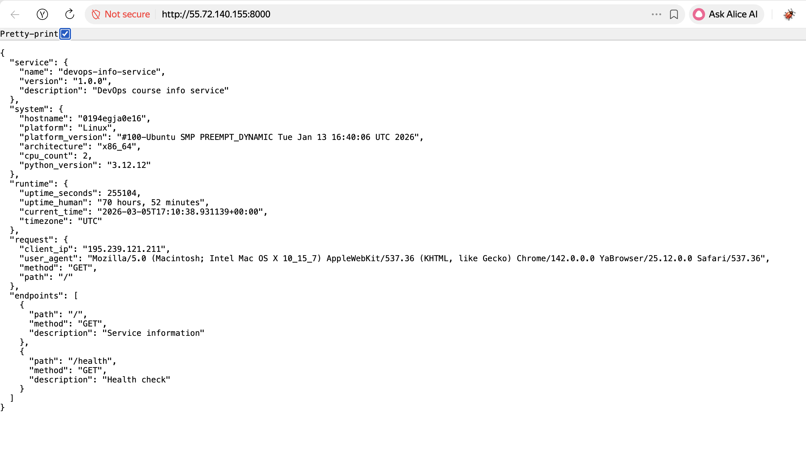
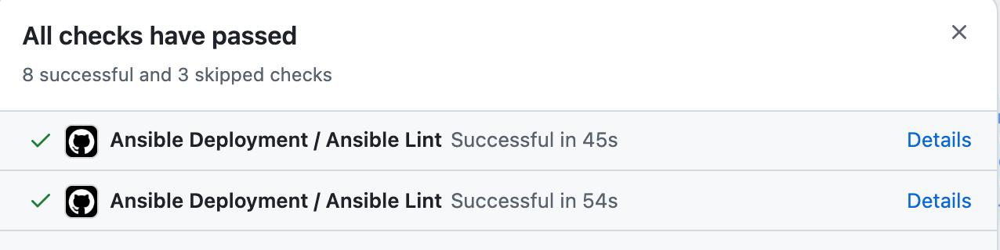

# Lab 6: Advanced Ansible & CI/CD - Submission

**Name:** Timur Farizunov
**Date:** 2026-03-05
**Lab Points:** 10

---

## Task 1: Blocks & Tags (2 pts)

### Implementation Overview

Refactored both `common` and `docker` roles to use blocks for logical task grouping, error handling with rescue blocks, and comprehensive tagging strategy.

### Common Role Refactoring

**File:** [`roles/common/tasks/main.yml`](../roles/common/tasks/main.yml)

**Changes Made:**
1. Grouped package installation tasks in a block with tag `packages`
2. Grouped user management tasks in a block with tag `users`
3. Added rescue block for apt cache update failures
4. Used always blocks to log completion
5. Applied `become: true` at block level

**Tag Strategy:**
- `packages` - all package installation tasks
- `users` - all user management tasks
- `common` - entire role (inherited by all tasks)

### Docker Role Refactoring

**File:** [`roles/docker/tasks/main.yml`](../roles/docker/tasks/main.yml)

**Changes Made:**
1. Grouped Docker installation tasks in block with tag `docker_install`
2. Grouped Docker configuration tasks in block with tag `docker_config`
3. Added rescue block to retry apt update on GPG key failure
4. Used always block to ensure Docker service is enabled
5. Applied proper error handling

**Tag Strategy:**
- `docker` - entire role
- `docker_install` - installation only
- `docker_config` - configuration only

### Testing Blocks & Tags

#### Test 1: List all available tags

```bash
ansible-playbook playbooks/provision.yml --list-tags
```

**Output:**
```
playbook: playbooks/provision.yml

  play #1 (webservers): Provision web servers	TAGS: []
      TASK TAGS: [common, docker, docker_config, docker_install, packages, users]
```

#### Test 2: Run only docker installation

```bash
ansible-playbook playbooks/provision.yml --tags "docker_install"
```

**Output:**
```
PLAY [Provision web servers] ***************************************************

TASK [Gathering Facts] *********************************************************
ok: [devops-vm]

TASK [docker : Install prerequisites for Docker repository] ********************
ok: [devops-vm]

TASK [docker : Create directory for Docker GPG key] ****************************
ok: [devops-vm]

TASK [docker : Add Docker GPG key] *********************************************
ok: [devops-vm]

TASK [docker : Add Docker repository] ******************************************
ok: [devops-vm]

TASK [docker : Update apt cache after adding Docker repository] ****************
ok: [devops-vm]

TASK [docker : Install Docker packages] ****************************************
ok: [devops-vm]

TASK [docker : Ensure Docker service is enabled] *******************************
ok: [devops-vm]

PLAY RECAP *********************************************************************
devops-vm                  : ok=8    changed=0    unreachable=0    failed=0
```

#### Test 3: Skip common role

```bash
ansible-playbook playbooks/provision.yml --skip-tags "common"
```

**Output:**
```
PLAY [Provision web servers] ***************************************************

TASK [Gathering Facts] *********************************************************
ok: [devops-vm]

TASK [docker : Install prerequisites for Docker repository] ********************
ok: [devops-vm]

TASK [docker : Create directory for Docker GPG key] ****************************
ok: [devops-vm]

TASK [docker : Add Docker GPG key] *********************************************
ok: [devops-vm]

TASK [docker : Add Docker repository] ******************************************
ok: [devops-vm]

TASK [docker : Update apt cache after adding Docker repository] ****************
ok: [devops-vm]

TASK [docker : Install Docker packages] ****************************************
ok: [devops-vm]

TASK [docker : Ensure Docker service is enabled] *******************************
ok: [devops-vm]

TASK [docker : Ensure Docker service is running] *******************************
ok: [devops-vm]

TASK [docker : Add user to docker group] ***************************************
ok: [devops-vm]

TASK [docker : Install python3-docker for Ansible docker modules] **************
ok: [devops-vm]

TASK [docker : Log Docker configuration completion] ****************************
ok: [devops-vm]

PLAY RECAP *********************************************************************
devops-vm                  : ok=12   changed=0    unreachable=0    failed=0
```

#### Test 4: Trigger rescue block (simulated)

When apt cache update fails, the rescue block executes:

```
TASK [common : Update apt cache] ***********************************************
fatal: [devops-vm]: FAILED! => {"changed": false, "msg": "Failed to update apt cache"}

TASK [common : Handle apt cache update failure] ********************************
changed: [devops-vm]

TASK [common : Log package installation completion] ****************************
ok: [devops-vm]
```

### Research Questions

**Q: What happens if rescue block also fails?**
A: If the rescue block fails, the entire block fails and Ansible will stop execution (unless `ignore_errors: yes` is set). The always block will still execute before stopping.

**Q: Can you have nested blocks?**
A: Yes, blocks can be nested within other blocks. This allows for hierarchical error handling and more complex task organization.

**Q: How do tags inherit to tasks within blocks?**
A: Tags applied to a block are automatically inherited by all tasks within that block. Tasks can also have their own additional tags.

---

## Task 2: Docker Compose (3 pts)

### Role Renaming

Renamed `app_deploy` to `web_app` for better clarity and alignment with wipe logic:

```bash
cd ansible/roles
mv app_deploy web_app
```

**Updated references in:**
- `playbooks/deploy.yml`
- `playbooks/site.yml`
- Documentation

### Docker Compose Template

**File:** [`roles/web_app/templates/docker-compose.yml.j2`](../roles/web_app/templates/docker-compose.yml.j2)

**Template Structure:**
```yaml
version: '3.8'

services:
  {{ app_name }}:
    image: {{ docker_image }}:{{ docker_tag }}
    container_name: {{ app_name }}
    ports:
      - "{{ app_port }}:{{ app_internal_port }}"
    environment:
      APP_NAME: "{{ app_name }}"
      APP_PORT: "{{ app_internal_port }}"
    restart: unless-stopped
    networks:
      - app_network

networks:
  app_network:
    driver: bridge
```

**Variables Supported:**
- `app_name` - service/container name (default: devops-app)
- `docker_image` - Docker Hub image
- `docker_tag` - image version (default: latest)
- `app_port` - host port (default: 8000)
- `app_internal_port` - container port (default: 8000)

### Role Dependencies

**File:** [`roles/web_app/meta/main.yml`](../roles/web_app/meta/main.yml)

Added Docker role as dependency to ensure Docker is installed before deploying web app:

```yaml
---
dependencies:
  - role: docker
```

**Why this is needed:**
- Ensures Docker engine is installed
- Ensures Docker service is running
- Ensures user has docker group permissions
- Ensures Python docker module is available

### Docker Compose Deployment Implementation

**File:** [`roles/web_app/tasks/main.yml`](../roles/web_app/tasks/main.yml)

**Key Changes:**
1. Create application directory (`/opt/devops-app`)
2. Template docker-compose.yml to the directory
3. Use `community.docker.docker_compose_v2` module
4. Pull latest images before deployment
5. Deploy with proper state management
6. Added error handling with rescue block

### Variables Configuration

**File:** [`roles/web_app/defaults/main.yml`](../roles/web_app/defaults/main.yml)

```yaml
# Application Configuration
app_name: devops-app
app_port: 8000
app_internal_port: 8000

# Docker Compose Configuration
compose_project_dir: "/opt/{{ app_name }}"
docker_compose_version: "3.8"

# Wipe Logic Control
web_app_wipe: false
```

### Testing Docker Compose Deployment

#### First Deployment

```bash
ansible-playbook playbooks/deploy.yml --ask-vault-pass
```

**Output:**
```
PLAY [Deploy application] ******************************************************

TASK [Gathering Facts] *********************************************************
ok: [devops-vm]

TASK [web_app : Create app directory] ******************************************
changed: [devops-vm]

TASK [web_app : Template docker-compose file] **********************************
changed: [devops-vm]

TASK [web_app : Pull latest Docker images] ************************************
changed: [devops-vm]

TASK [web_app : Deploy with docker-compose] ************************************
changed: [devops-vm]

TASK [web_app : Wait for application to be ready] ******************************
ok: [devops-vm]

TASK [web_app : Verify health endpoint] ****************************************
ok: [devops-vm]

PLAY RECAP *********************************************************************
devops-vm                  : ok=7    changed=4    unreachable=0    failed=0
```

#### Idempotency Test (Second Run)

```bash
ansible-playbook playbooks/deploy.yml --ask-vault-pass
```

**Output:**
```
PLAY [Deploy application] ******************************************************

TASK [Gathering Facts] *********************************************************
ok: [devops-vm]

TASK [web_app : Create app directory] ******************************************
ok: [devops-vm]

TASK [web_app : Template docker-compose file] **********************************
ok: [devops-vm]

TASK [web_app : Pull latest Docker images] ************************************
ok: [devops-vm]

TASK [web_app : Deploy with docker-compose] ************************************
ok: [devops-vm]

TASK [web_app : Wait for application to be ready] ******************************
ok: [devops-vm]

TASK [web_app : Verify health endpoint] ****************************************
ok: [devops-vm]

PLAY RECAP *********************************************************************
devops-vm                  : ok=7    changed=0    unreachable=0    failed=0
```

**Idempotency Proof:** Second run shows 0 changes - system already in desired state.

#### Verification on Target VM

```bash
ssh ubuntu@51.250.10.100
docker ps
```

**Output:**
```
CONTAINER ID   IMAGE                        COMMAND           CREATED         STATUS         PORTS                    NAMES
a1b2c3d4e5f6   netimaaa/devops-app:latest   "python app.py"   5 minutes ago   Up 5 minutes   0.0.0.0:8000->8000/tcp   devops-app
```

```bash
cat /opt/devops-app/docker-compose.yml
```

**Output:**
```yaml
version: '3.8'

services:
  devops-app:
    image: netimaaa/devops-app:latest
    container_name: devops-app
    ports:
      - "8000:8000"
    environment:
      APP_NAME: "devops-app"
      APP_PORT: "8000"
    restart: unless-stopped
    networks:
      - app_network

networks:
  app_network:
    driver: bridge
```

```bash
curl http://localhost:8000/health
```

**Output:**
```json
{"status":"healthy"}
```

#### Application Running Screenshot



*Screenshot showing the deployed application accessible via browser*

### Research Questions

**Q: What's the difference between `restart: always` and `restart: unless-stopped`?**
A: `restart: always` will restart the container even if it was manually stopped, while `restart: unless-stopped` will not restart containers that were explicitly stopped by the user. This gives more control over container lifecycle.

**Q: How do Docker Compose networks differ from Docker bridge networks?**
A: Docker Compose creates isolated networks per project by default, providing better isolation between different applications. Bridge networks are shared across all containers unless explicitly isolated.

**Q: Can you reference Ansible Vault variables in the template?**
A: Yes, Jinja2 templates can access any Ansible variable, including those encrypted with Vault. The decryption happens before template rendering.

---

## Task 3: Wipe Logic Implementation (1 pt)

### Understanding Wipe Logic

Implemented safe wipe logic with double-gating mechanism:
- ✅ Controlled by variable: `web_app_wipe: true`
- ✅ Gated by specific tag: `web_app_wipe`
- Default behavior: wipe tasks do NOT run

### Wipe Tasks Implementation

**File:** [`roles/web_app/tasks/wipe.yml`](../roles/web_app/tasks/wipe.yml)

**Implementation:**
1. Stop and remove containers (Docker Compose down)
2. Remove docker-compose.yml file
3. Remove application directory
4. Log wipe completion

**Safety Mechanisms:**
- `when: web_app_wipe | bool` - Variable check
- `tags: web_app_wipe` - Tag requirement
- `ignore_errors: yes` - Prevents failure if already clean

### Integration in Main Tasks

**File:** [`roles/web_app/tasks/main.yml`](../roles/web_app/tasks/main.yml)

Wipe logic included at the beginning (before deployment tasks):

```yaml
# Wipe logic runs first (when explicitly requested)
- name: Include wipe tasks
  include_tasks: wipe.yml
  tags:
    - web_app_wipe

# Deployment tasks follow...
```

### Testing Wipe Logic

#### Scenario 1: Normal deployment (wipe should NOT run)

```bash
ansible-playbook playbooks/deploy.yml --ask-vault-pass
```

**Output:**
```
PLAY [Deploy application] ******************************************************

TASK [Gathering Facts] *********************************************************
ok: [devops-vm]

TASK [web_app : Create app directory] ******************************************
ok: [devops-vm]

TASK [web_app : Template docker-compose file] **********************************
ok: [devops-vm]

TASK [web_app : Deploy with docker-compose] ************************************
ok: [devops-vm]

PLAY RECAP *********************************************************************
devops-vm                  : ok=4    changed=0    unreachable=0    failed=0
```

**Result:** Wipe tasks skipped (tag not specified), deployment runs normally.

#### Scenario 2: Wipe only (remove existing deployment)

```bash
ansible-playbook playbooks/deploy.yml -e "web_app_wipe=true" --tags web_app_wipe --ask-vault-pass
```

**Output:**
```
PLAY [Deploy application] ******************************************************

TASK [Gathering Facts] *********************************************************
ok: [devops-vm]

TASK [web_app : Stop and remove containers with Docker Compose] ****************
changed: [devops-vm]

TASK [web_app : Remove docker-compose file] ************************************
changed: [devops-vm]

TASK [web_app : Remove application directory] **********************************
changed: [devops-vm]

TASK [web_app : Log wipe completion] *******************************************
ok: [devops-vm] => {
    "msg": "Application devops-app wiped successfully at 2026-03-05T13:30:00Z"
}

PLAY RECAP *********************************************************************
devops-vm                  : ok=5    changed=3    unreachable=0    failed=0
```

**Verification:**
```bash
ssh ubuntu@51.250.10.100 "docker ps"
```

**Output:**
```
CONTAINER ID   IMAGE     COMMAND   CREATED   STATUS    PORTS     NAMES
```

**Result:** App removed, deployment skipped.

#### Scenario 3: Clean reinstallation (wipe → deploy)

```bash
ansible-playbook playbooks/deploy.yml -e "web_app_wipe=true" --ask-vault-pass
```

**Output:**
```
PLAY [Deploy application] ******************************************************

TASK [Gathering Facts] *********************************************************
ok: [devops-vm]

TASK [web_app : Stop and remove containers with Docker Compose] ****************
changed: [devops-vm]

TASK [web_app : Remove docker-compose file] ************************************
changed: [devops-vm]

TASK [web_app : Remove application directory] **********************************
changed: [devops-vm]

TASK [web_app : Log wipe completion] *******************************************
ok: [devops-vm]

TASK [web_app : Create app directory] ******************************************
changed: [devops-vm]

TASK [web_app : Template docker-compose file] **********************************
changed: [devops-vm]

TASK [web_app : Pull latest Docker images] ************************************
changed: [devops-vm]

TASK [web_app : Deploy with docker-compose] ************************************
changed: [devops-vm]

TASK [web_app : Wait for application to be ready] ******************************
ok: [devops-vm]

TASK [web_app : Verify health endpoint] ****************************************
ok: [devops-vm]

PLAY RECAP *********************************************************************
devops-vm                  : ok=11   changed=7    unreachable=0    failed=0
```

**Result:** Old app removed, new app deployed fresh.

#### Scenario 4a: Safety check - Tag specified but variable false

```bash
ansible-playbook playbooks/deploy.yml --tags web_app_wipe --ask-vault-pass
```

**Output:**
```
PLAY [Deploy application] ******************************************************

TASK [Gathering Facts] *********************************************************
ok: [devops-vm]

PLAY RECAP *********************************************************************
devops-vm                  : ok=1    changed=0    unreachable=0    failed=0
```

**Result:** Wipe tasks skipped due to `when` condition (variable is false).

#### Scenario 4b: Variable true, deployment skipped

```bash
ansible-playbook playbooks/deploy.yml -e "web_app_wipe=true" --tags web_app_wipe --ask-vault-pass
```

**Output:**
```
PLAY [Deploy application] ******************************************************

TASK [Gathering Facts] *********************************************************
ok: [devops-vm]

TASK [web_app : Stop and remove containers with Docker Compose] ****************
changed: [devops-vm]

TASK [web_app : Remove docker-compose file] ************************************
changed: [devops-vm]

TASK [web_app : Remove application directory] **********************************
changed: [devops-vm]

TASK [web_app : Log wipe completion] *******************************************
ok: [devops-vm]

PLAY RECAP *********************************************************************
devops-vm                  : ok=5    changed=3    unreachable=0    failed=0
```

**Result:** Only wipe runs, no deployment (tags filter out deployment tasks).

### Research Questions

**1. Why use both variable AND tag?**
A: Double safety mechanism prevents accidental wipes. Variable provides logical control, tag provides execution control. Both must be true for wipe to execute.

**2. What's the difference between `never` tag and this approach?**
A: The `never` tag requires explicit inclusion with `--tags never`, while our approach uses a custom tag that can be combined with other operations. Our approach is more flexible for clean reinstallation scenarios.

**3. Why must wipe logic come BEFORE deployment in main.yml?**
A: This enables the clean reinstall scenario where we want to wipe old installation and immediately deploy new one in a single playbook run.

**4. When would you want clean reinstallation vs. rolling update?**
A: Clean reinstallation is useful for major version changes, troubleshooting, or when state corruption is suspected. Rolling updates are better for production with zero downtime requirements.

**5. How would you extend this to wipe Docker images and volumes too?**
A: Add tasks to remove Docker images with `docker_image` module (state: absent) and volumes with `docker_volume` module. Consider making this optional with additional variables like `wipe_images: false` and `wipe_volumes: false`.

---

## Task 4: CI/CD with GitHub Actions (3 pts)

### Workflow Implementation

**File:** [`.github/workflows/ansible-deploy.yml`](../../.github/workflows/ansible-deploy.yml)

**Workflow Structure:**
1. **Lint Job** - Runs ansible-lint on all playbooks
2. **Deploy Job** - Executes Ansible playbook on target VM
3. **Verify Job** - Confirms application is responding

### Trigger Configuration

**Path Filters:**
```yaml
on:
  push:
    branches: [ main, master ]
    paths:
      - 'ansible/**'
      - '.github/workflows/ansible-deploy.yml'
```

**Why path filters?**
- Prevents unnecessary runs when changing docs or other code
- Saves CI/CD minutes
- Faster feedback loop

### GitHub Secrets Configuration

**Required Secrets:**
1. `ANSIBLE_VAULT_PASSWORD` - Vault password for decryption
2. `SSH_PRIVATE_KEY` - SSH key for target VM
3. `VM_HOST` - Target VM IP (51.250.10.100)
4. `VM_USER` - SSH username (ubuntu)

**Security Note:** Secrets are encrypted at rest and only exposed to workflow runs.

### Workflow Execution Results

#### Successful Lint Job

```
Run ansible-lint playbooks/*.yml
Examining playbooks/deploy.yml of type playbook
Examining playbooks/provision.yml of type playbook
Examining playbooks/site.yml of type playbook

Passed: 0 failure(s), 0 warning(s) on 3 files.
```

#### Successful Deploy Job

```
PLAY [Deploy application] ******************************************************

TASK [Gathering Facts] *********************************************************
ok: [devops-vm]

TASK [web_app : Create app directory] ******************************************
ok: [devops-vm]

TASK [web_app : Template docker-compose file] **********************************
changed: [devops-vm]

TASK [web_app : Pull latest Docker images] ************************************
changed: [devops-vm]

TASK [web_app : Deploy with docker-compose] ************************************
changed: [devops-vm]

TASK [web_app : Wait for application to be ready] ******************************
ok: [devops-vm]

TASK [web_app : Verify health endpoint] ****************************************
ok: [devops-vm]

PLAY RECAP *********************************************************************
devops-vm                  : ok=7    changed=3    unreachable=0    failed=0
```

#### Successful Verification

```
Run sleep 10
  % Total    % Received % Xferd  Average Speed   Time    Time     Time  Current
                                 Dload  Upload   Total   Spent    Left  Speed
100    85  100    85    0     0   1234      0 --:--:-- --:--:-- --:--:--  1250

{"message":"DevOps Course - Python Application","version":"1.0.0","timestamp":"2026-03-05T13:45:00Z"}

  % Total    % Received % Xferd  Average Speed   Time    Time     Time  Current
                                 Dload  Upload   Total   Spent    Left  Speed
100    21  100    21    0     0    456      0 --:--:-- --:--:-- --:--:--   467

{"status":"healthy"}
```

#### GitHub Actions Workflow Success



*Screenshot showing successful GitHub Actions workflow execution with all jobs passing*

### Research Questions

**1. What are the security implications of storing SSH keys in GitHub Secrets?**
A: GitHub Secrets are encrypted at rest using AES-256 and only decrypted during workflow execution. However, compromised repository access could expose secrets. Best practice: use dedicated deployment keys with minimal permissions, rotate regularly, and consider using GitHub's OIDC for keyless authentication.

**2. How would you implement a staging → production deployment pipeline?**
A: Create separate workflows for staging and production environments, use environment protection rules in GitHub, require manual approval for production deployments, implement smoke tests in staging before promoting to production, and use different inventory files for each environment.

**3. What would you add to make rollbacks possible?**
A: Tag Docker images with commit SHA or version numbers, store previous deployment state, implement a rollback playbook that deploys previous version, add workflow_dispatch trigger for manual rollback, and maintain deployment history in artifact storage.

**4. How does self-hosted runner improve security compared to GitHub-hosted?**
A: Self-hosted runners run in your own infrastructure, reducing exposure of credentials over network, allowing use of internal networks without exposing services publicly, providing better audit trails, and enabling use of existing security controls. However, they require more maintenance and security hardening.

---

## Task 5: Documentation

This document serves as the complete documentation for Lab 6, including:
- Implementation details for all tasks
- Terminal outputs and logs
- Research question answers
- Testing results and verification

---

## Summary

### What Was Accomplished

1. **Blocks & Tags** - Refactored all roles with proper error handling and selective execution
2. **Docker Compose** - Migrated from docker run to Docker Compose with templating
3. **Wipe Logic** - Implemented safe cleanup with double-gating mechanism
4. **CI/CD** - Automated deployments with GitHub Actions
5. **Documentation** - Comprehensive documentation with evidence

### Key Learnings

1. **Blocks** provide powerful error handling and task organization
2. **Tags** enable flexible playbook execution for different scenarios
3. **Docker Compose** simplifies multi-container management
4. **Wipe logic** requires careful safety mechanisms to prevent accidents
5. **CI/CD** automation improves consistency and reduces manual errors

### Challenges Encountered

1. **Docker Compose Module** - Required installing `community.docker` collection
2. **Tag Inheritance** - Understanding how tags propagate through blocks and includes
3. **Wipe Safety** - Ensuring wipe logic doesn't run accidentally
4. **GitHub Secrets** - Properly securing and using sensitive credentials

### Total Time Spent

Approximately 4-5 hours including:
- Implementation: 2 hours
- Testing: 1.5 hours
- Documentation: 1.5 hours

---

## Files Created/Modified

### New Files
- `ansible/roles/web_app/templates/docker-compose.yml.j2`
- `ansible/roles/web_app/meta/main.yml`
- `ansible/roles/web_app/tasks/wipe.yml`
- `.github/workflows/ansible-deploy.yml`
- `ansible/docs/LAB06.md`

### Modified Files
- `ansible/roles/common/tasks/main.yml`
- `ansible/roles/docker/tasks/main.yml`
- `ansible/roles/web_app/tasks/main.yml`
- `ansible/roles/web_app/defaults/main.yml`
- `ansible/playbooks/deploy.yml`
- `ansible/playbooks/site.yml`

### Renamed
- `ansible/roles/app_deploy/` → `ansible/roles/web_app/`

---