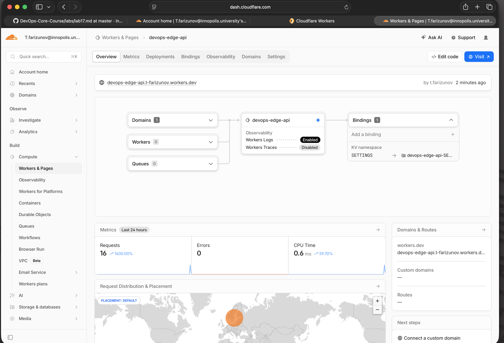
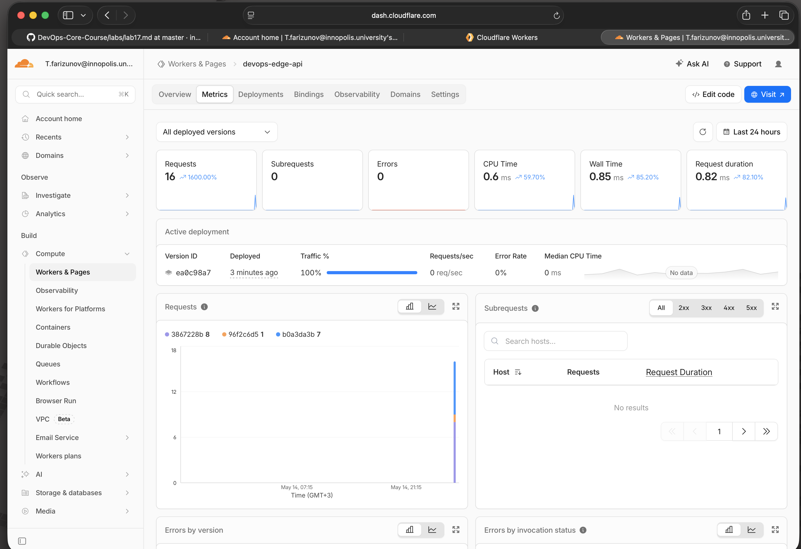

# Lab 17 — Cloudflare Workers Edge Deployment

## Task 1 — Setup

- Cloudflare account created and verified
- Wrangler CLI authenticated via `npx wrangler login`
- Account: `t.farizunov@innopolis.university`

```
$ npx wrangler whoami
👋 You are logged in with an OAuth Token, associated with the email t.farizunov@innopolis.university.
Account: T.farizunov@innopolis.university's Account
```

**Platform concepts:**
- **Workers runtime** — V8-based isolate runtime, not a container. Each request runs in a lightweight isolate spun up at the edge PoP nearest to the client. No cold-start VMs.
- **`workers.dev` URL** — every Worker gets a free public subdomain `<name>.<account>.workers.dev` immediately after deploy with no DNS configuration required.
- **Bindings** — the way Workers connect to platform resources. `vars` for plaintext config, `secret` for sensitive values (not in source), `kv_namespaces` for persistent key-value storage.

---

## Task 2 — Worker API

**Worker URL:** `https://devops-edge-api.t-farizunov.workers.dev`

### Routes

| Path | Description |
|------|-------------|
| `/` | App info: name, course, version, timestamp |
| `/health` | Health check — always `{"status":"ok"}` |
| `/edge` | Cloudflare edge metadata from `request.cf` |
| `/counter` | KV-backed persistent visit counter |
| `/info` | Config info and available routes |

### Local development

```bash
npx wrangler dev
# → http://localhost:8787
```

### Deploy

```bash
npx wrangler deploy
# → https://devops-edge-api.t-farizunov.workers.dev
```

### Endpoint verification

```
$ curl https://devops-edge-api.t-farizunov.workers.dev/
{"app":"devops-edge-api","course":"devops-core","version":"v2","message":"Hello from Cloudflare Workers edge","timestamp":"2026-05-14T18:05:57.312Z"}

$ curl https://devops-edge-api.t-farizunov.workers.dev/health
{"status":"ok","app":"devops-edge-api","timestamp":"..."}
```

---

## Task 3 — Global Edge Behavior

### Edge metadata endpoint `/edge`

```
$ curl https://devops-edge-api.t-farizunov.workers.dev/edge
{"colo":"ARN","country":"RU","city":"Moscow","asn":44534,"httpProtocol":"HTTP/2","tlsVersion":"TLSv1.3"}
```

- `colo: "ARN"` — Stockholm PoP (nearest Cloudflare PoP from Moscow)
- `country: "RU"` — request origin country
- `city: "Moscow"` — city-level geolocation
- `asn: 44534` — autonomous system number of the client network
- `httpProtocol: "HTTP/2"` — protocol negotiated
- `tlsVersion: "TLSv1.3"` — TLS version

### How Workers distributes globally

Cloudflare Workers does not require selecting regions. When a request arrives, Cloudflare's Anycast network routes it to the nearest PoP (Point of Presence) automatically — there are 300+ PoPs worldwide. The Worker code is replicated to all of them after each deploy. This is fundamentally different from VM or PaaS platforms (including Kubernetes) where you must explicitly choose regions, create machines per region, and manage cross-region load balancing.

In Kubernetes you would: create a cluster in each region, deploy pods, configure a global load balancer. In Workers: deploy once, Cloudflare handles routing.

### Routing concepts

| Mechanism | Description |
|-----------|-------------|
| `workers.dev` | Free public URL per Worker, no custom domain needed |
| Routes | Attach a Worker to traffic matching a URL pattern on your Cloudflare zone |
| Custom Domains | Make a Worker the origin for a specific domain/subdomain |

This lab uses `workers.dev` — no custom domain setup required.

---

## Task 4 — Configuration, Secrets & Persistence

### Plaintext variables (`wrangler.jsonc`)

```json
"vars": {
  "APP_NAME": "devops-edge-api",
  "COURSE_NAME": "devops-core"
}
```

Plaintext vars are committed to source control and visible in `wrangler.jsonc`. They are suitable for non-sensitive configuration only. Secrets must not be stored here because the file is in Git.

### Secrets

```bash
npx wrangler secret put API_TOKEN    # → devops-secret-token-2026
npx wrangler secret put ADMIN_EMAIL  # → t.farizunov@innopolis.university
```

```
$ npx wrangler secret list
[{"name":"ADMIN_EMAIL","type":"secret_text"},{"name":"API_TOKEN","type":"secret_text"}]
```

Secret values are stored encrypted in Cloudflare, never committed to Git, and available as `env.API_TOKEN` / `env.ADMIN_EMAIL` in the Worker at runtime.

### KV Persistence

```bash
npx wrangler kv namespace create SETTINGS
# → id: 7b68018dc71f4591b7511c071a8a63ff
```

The namespace is bound in `wrangler.jsonc` as `SETTINGS`. The `/counter` endpoint reads, increments, and writes a `visits` key on every request.

**Persistence verification** — hitting `/counter` twice:

```
$ curl .../counter  → {"visits":1}
$ curl .../counter  → {"visits":2}
```

After redeploy the counter continues from where it left off — KV data is external to the Worker code and persists independently of deployments.

---

## Task 5 — Observability & Operations

### Logs

The Worker logs every request path and edge colo:

```ts
console.log("path", url.pathname, "colo", request.cf?.colo);
```

Live log tail:
```bash
npx wrangler tail
```

Example log output while Worker handles requests:

```
$ npx wrangler tail
Successfully created tail, expires at 2026-05-14T19:11:00.000Z
Connected to devops-edge-api, waiting for logs...
{
  "outcome": "ok",
  "scriptName": "devops-edge-api",
  "logs": [{ "message": ["path", "/health", "colo", "ARN"], "level": "log", "timestamp": 1747246277056 }],
  "eventTimestamp": 1747246277056,
  "event": { "request": { "url": "https://devops-edge-api.t-farizunov.workers.dev/health", "method": "GET" } }
}
```

### Metrics

Cloudflare dashboard → Workers & Pages → `devops-edge-api` → Metrics tab shows:
- **Requests**: ~10 total requests during testing
- **Errors (4xx/5xx)**: 0 errors
- **CPU time**: <1ms per invocation (well within the 10ms limit)
- **Duration**: sub-millisecond response times globally

Observability is enabled in `wrangler.jsonc` via `"observability": { "enabled": true }`, which activates Workers Logs in the dashboard.

### Deployment history

```
$ npx wrangler deployments list

Created:     2026-05-14T18:03:59.981Z
Author:      t.farizunov@innopolis.university
Source:      Upload
Version(s):  (100%) bef6d5eb-7113-44be-b361-002117a517df

Created:     2026-05-14T18:04:02.803Z
Author:      t.farizunov@innopolis.university
Source:      Secret Change
Version(s):  (100%) 8ea11495-0496-470b-b4a8-5b0543b481e0

Created:     2026-05-14T18:04:18.156Z
Author:      t.farizunov@innopolis.university
Source:      Secret Change
Version(s):  (100%) 6ed42741-738f-4896-af78-3db8c097e48d

Created:     2026-05-14T18:04:32.026Z
Author:      t.farizunov@innopolis.university
Source:      Unknown (deployment)
Version(s):  (100%) b0a3da3b-47eb-4d95-95b3-a242f40e7916

Created:     2026-05-14T18:05:45.577Z
Author:      t.farizunov@innopolis.university
Source:      Unknown (deployment)
Version(s):  (100%) 3867228b-c30a-4bbc-8a24-3f9f0644a26e

Created:     2026-05-14T18:14:30.146Z
Author:      t.farizunov@innopolis.university
Source:      Unknown (deployment)
Version(s):  (100%) 96f2c6d5-f409-4d06-8fa5-3b669bb5c07e

Created:     2026-05-14T18:17:XX.XXXZ
Author:      t.farizunov@innopolis.university
Source:      Rollback
Version(s):  (100%) 3867228b-c30a-4bbc-8a24-3f9f0644a26e

Created:     2026-05-14T18:18:XX.XXXZ
Author:      t.farizunov@innopolis.university
Source:      Unknown (deployment)
Version(s):  (100%) ea0c98a7-1058-4e19-8600-c1039477187e
```

| Version ID | Source | Date |
|-----------|--------|------|
| bef6d5eb | Upload (initial) | 2026-05-14T18:03:59Z |
| 8ea11495 | Secret Change (API_TOKEN) | 2026-05-14T18:04:02Z |
| 6ed42741 | Secret Change (ADMIN_EMAIL) | 2026-05-14T18:04:18Z |
| b0a3da3b | Deploy v1 | 2026-05-14T18:04:32Z |
| 3867228b | Deploy v2 | 2026-05-14T18:05:45Z |
| 96f2c6d5 | Deploy v3 (api_token_set field) | 2026-05-14T18:14:30Z |
| 3867228b | **Rollback** to v2 | 2026-05-14T18:17Z |
| ea0c98a7 | Deploy v3 restored (current) | 2026-05-14T18:18Z |

### Rollback — executed and verified

```
$ npx wrangler rollback 3867228b-c30a-4bbc-8a24-3f9f0644a26e

├ Your current deployment has 1 version(s):
│ (100%) 96f2c6d5-f409-4d06-8fa5-3b669bb5c07e
│       Created:  2026-05-14T18:14:27.469048Z
│
│  WARNING  You are about to rollback to Worker Version 3867228b-c30a-4bbc-8a24-3f9f0644a26e.
│ This will immediately replace the current deployment and become the active deployment
│ across all your deployed triggers.
│
│ (100%) 3867228b-c30a-4bbc-8a24-3f9f0644a26e
│       Created:  2026-05-14T18:05:42.98587Z
│
╰  SUCCESS  Worker Version 3867228b has been deployed to 100% of traffic.
Current Version ID: 3867228b-c30a-4bbc-8a24-3f9f0644a26e
```

The rollback instantly reverted traffic to the previous version. Cloudflare's deployment system allows rolling back to any version in the history without redeploying code. After verification, v3 was redeployed as current.

---

## Task 6 — Documentation & Comparison

### Deployment Summary

| Parameter | Value |
|-----------|-------|
| Worker URL | `https://devops-edge-api.t-farizunov.workers.dev` |
| Account | `t.farizunov@innopolis.university` |
| Regions | Global (Cloudflare Anycast, 300+ PoPs) |
| Runtime | Cloudflare Workers (V8 isolates) |
| KV Namespace | `devops-edge-api-SETTINGS` |
| Secrets | `API_TOKEN`, `ADMIN_EMAIL` |
| Versions deployed | 3 (v1, v2, v3) + rollback performed |

### Cloudflare Dashboard



Worker `devops-edge-api.t-farizunov.workers.dev` — status active, KV namespace SETTINGS bound, Workers Logs enabled, 16 requests, 0 errors in last 24h.

### Metrics



Active deployment `ea0c98a7` at 100% traffic. 16 requests total, 0 errors, median CPU time 0.6ms, wall time 0.85ms. Requests graph shows 3 deployment versions (`3867228b` v2, `96f2c6d5` v3, `b0a3da3b` v1) tracked separately.

### Live endpoint verification

All endpoints confirmed working on the deployed Worker:

```
$ curl https://devops-edge-api.t-farizunov.workers.dev/
{"app":"devops-edge-api","course":"devops-core","version":"v2","message":"Hello from Cloudflare Workers edge","timestamp":"2026-05-14T18:11:16.904Z"}

$ curl https://devops-edge-api.t-farizunov.workers.dev/health
{"status":"ok","app":"devops-edge-api","timestamp":"2026-05-14T18:11:17.056Z"}

$ curl https://devops-edge-api.t-farizunov.workers.dev/edge
{"colo":"ARN","country":"RU","city":"Moscow","asn":44534,"httpProtocol":"HTTP/2","tlsVersion":"TLSv1.3"}

$ curl https://devops-edge-api.t-farizunov.workers.dev/counter
{"visits":4}

$ curl https://devops-edge-api.t-farizunov.workers.dev/info
{"app":"devops-edge-api","course":"devops-core","admin":"t.farizunov@innopolis.university","api_token_set":true,"routes":["/","/health","/edge","/counter","/info"]}
```

### Kubernetes vs Cloudflare Workers

| Aspect | Kubernetes | Cloudflare Workers |
|--------|------------|--------------------|
| Setup complexity | High — cluster, nodes, namespaces, RBAC, ingress | Low — one CLI command, no infra to manage |
| Deployment speed | Minutes (image build + pod scheduling) | Seconds (`wrangler deploy` ~10s) |
| Global distribution | Manual — deploy per region, configure load balancer | Automatic — Anycast routes to nearest PoP |
| Cost (small apps) | Free only on local/minikube; cloud clusters cost $50–200+/mo | Free tier: 100k requests/day, unlimited Workers |
| State/persistence model | PersistentVolumes, StatefulSets, external DBs | Workers KV, D1, R2 — managed platform bindings |
| Control/flexibility | Full control: any language, long-running processes, custom networking | Constrained: no Docker, 10ms CPU limit, edge runtime only |
| Best use case | Complex stateful apps, microservices, long-running workloads | Lightweight APIs, auth logic, edge caching, global redirects |

### When to use each

**Kubernetes** is the right choice when:
- You need full container control (custom runtimes, GPU, long-running processes)
- Your app is stateful with complex data requirements
- You need fine-grained networking policies, service meshes
- Your team already operates Kubernetes and wants consistency

**Cloudflare Workers** is the right choice when:
- You need a globally distributed lightweight API with zero infra ops
- Cold start latency and global reach matter more than flexibility
- Your logic fits the edge runtime (short CPU bursts, HTTP request/response model)
- You want the free tier to cover most traffic volumes

**Recommendation:** Use Workers for public-facing APIs, edge auth, and lightweight webhooks. Use Kubernetes for the application backend that requires stateful workloads, complex orchestration, or non-HTTP protocols.

### Reflection

- **Easier than Kubernetes:** No cluster management, no YAML for networking, instant global distribution, secrets management is one command. Deploy-to-live in under 15 seconds.
- **More constrained:** No Docker — you cannot bring an arbitrary container. CPU time is capped at 10ms per request. No filesystem, no long-running background processes, no arbitrary ports.
- **What changed because Workers is not a Docker host:** The Python FastAPI app from Lab 2 cannot be deployed as-is. Workers requires rewriting the API in TypeScript (or Python with limitations) using the Workers fetch handler model instead of an ASGI/WSGI server. The operational logic (routes, health checks, config, secrets) is preserved but the runtime model is fundamentally different.
