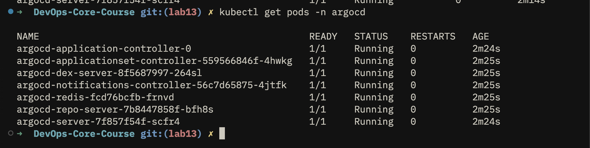
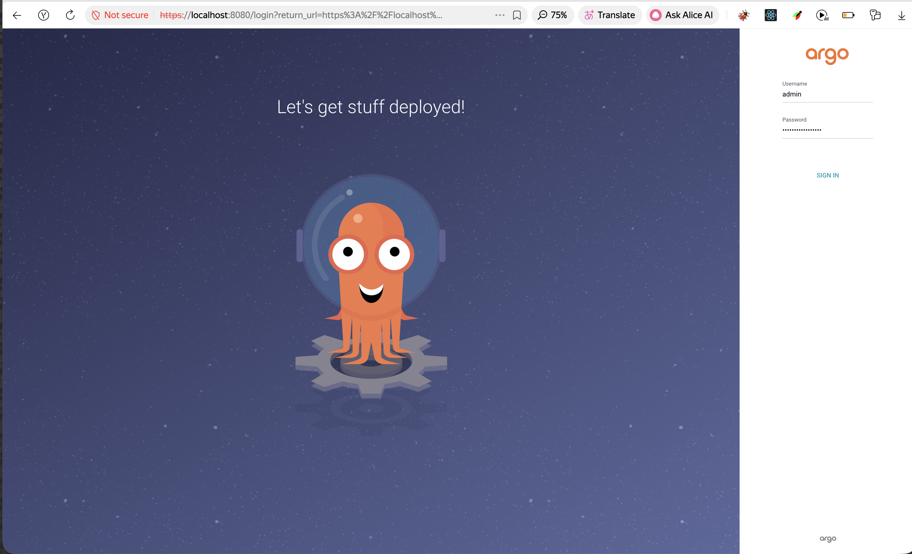
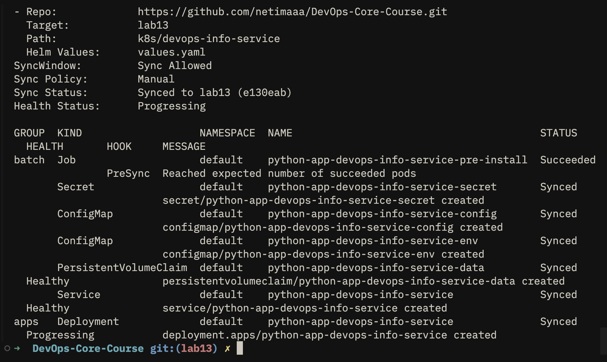
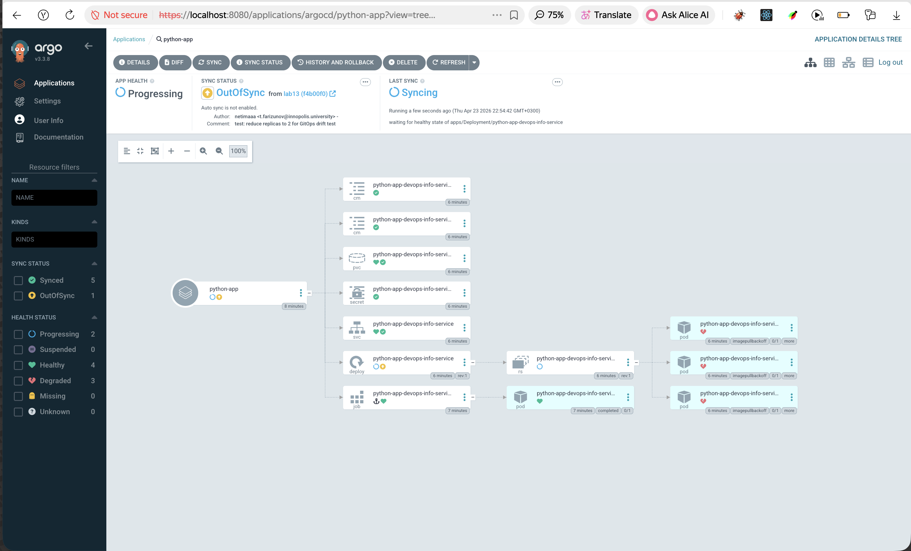
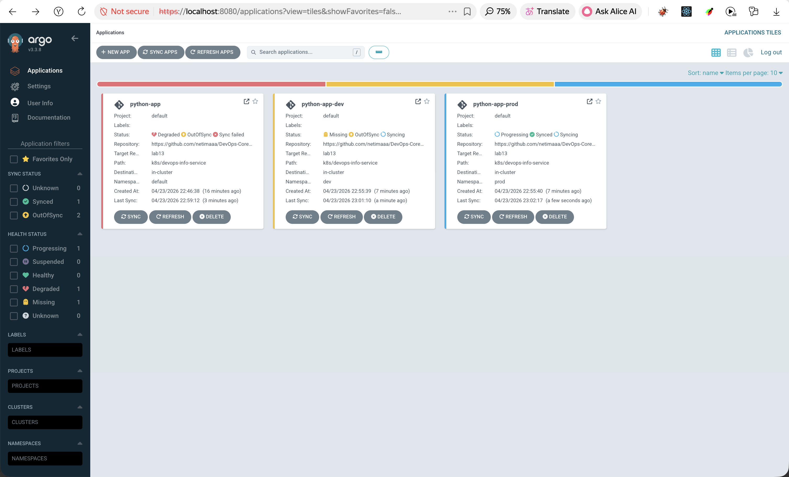
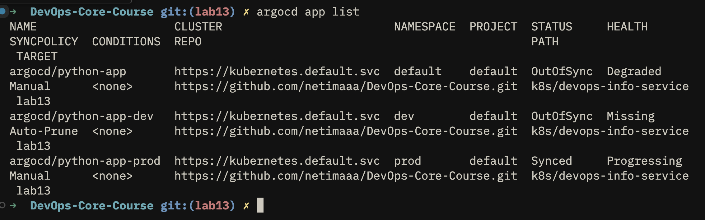
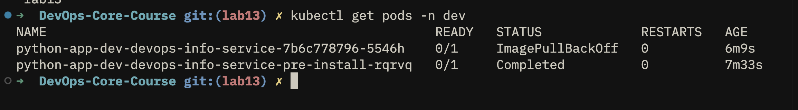
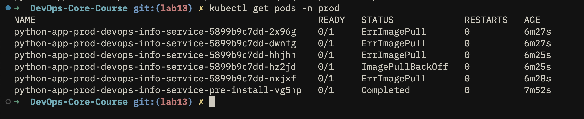
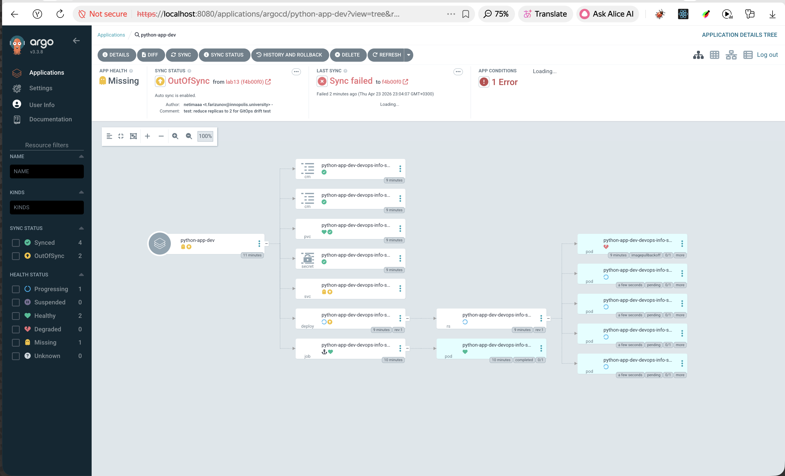
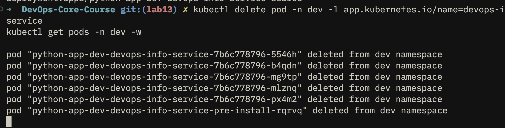

# Lab 13 — GitOps with ArgoCD

## 1. ArgoCD Setup

### Installation

ArgoCD was installed via Helm into a dedicated `argocd` namespace:

```bash
# Add ArgoCD Helm repository
helm repo add argo https://argoproj.github.io/argo-helm
helm repo update

# Create namespace
kubectl create namespace argocd

# Install ArgoCD
helm install argocd argo/argo-cd --namespace argocd

# Wait for server pod to be ready
kubectl wait --for=condition=ready pod \
  -l app.kubernetes.io/name=argocd-server \
  -n argocd --timeout=120s
```

### Installation Verification

```bash
kubectl get pods -n argocd
```

**Screenshot — pods running:**



### UI Access

Port-forward was used to expose the ArgoCD server locally:

```bash
kubectl port-forward svc/argocd-server -n argocd 8080:443
```

The UI is then accessible at **https://localhost:8080** (accept the self-signed certificate warning).

**Retrieve initial admin password:**

```bash
kubectl -n argocd get secret argocd-initial-admin-secret \
  -o jsonpath="{.data.password}" | base64 -d
```

Login credentials: **Username:** `admin` | **Password:** output of the command above (without the trailing `%`).

**Screenshot — ArgoCD UI dashboard (after login):**



### CLI Configuration

```bash
# Install on macOS
brew install argocd

# Log in (with port-forward running)
argocd login localhost:8080 --insecure
# Enter: admin / <password from above>

# Verify connection
argocd version
argocd app list
```

---

## 2. Application Configuration

### Directory Structure

```
k8s/argocd/
├── application.yaml        # Default app (namespace: default, manual sync)
├── application-dev.yaml    # Dev environment (auto-sync + selfHeal)
└── application-prod.yaml   # Prod environment (manual sync)
```

### application.yaml — Default Application

```yaml
apiVersion: argoproj.io/v1alpha1
kind: Application
metadata:
  name: python-app
  namespace: argocd
spec:
  project: default
  source:
    repoURL: https://github.com/netimaaa/DevOps-Core-Course.git
    targetRevision: lab13
    path: k8s/devops-info-service
    helm:
      valueFiles:
        - values.yaml
  destination:
    server: https://kubernetes.default.svc
    namespace: default
  syncPolicy:
    syncOptions:
      - CreateNamespace=true
```

**Key fields:**

| Field | Value | Purpose |
|-------|-------|---------|
| `repoURL` | `https://github.com/netimaaa/DevOps-Core-Course.git` | Git source of truth |
| `targetRevision` | `lab13` | Branch to track |
| `path` | `k8s/devops-info-service` | Helm chart location in repo |
| `destination.namespace` | `default` | Target namespace |
| `syncPolicy` | manual (no `automated` block) | Manual trigger required |

### Deploy and Sync

```bash
# Apply the Application resource
kubectl apply -f k8s/argocd/application.yaml

# Trigger initial sync via CLI
argocd app sync python-app

# Check status
argocd app get python-app
```

**Screenshot — Application in ArgoCD UI (Synced state):**



**Screenshot — Application details view (resources tree):**


### GitOps Workflow Test

A change was made to `values.yaml` (replica count modified from 3 to 2), committed, and pushed:

```bash
git add k8s/devops-info-service/values.yaml
git commit -m "test: reduce replicas to 2 for GitOps drift test"
git push origin lab13
```

ArgoCD detects the drift within its polling interval (~3 min) and shows **OutOfSync** status. After syncing:

```bash
argocd app sync python-app
```

The cluster state was updated to match Git.

**Screenshot — OutOfSync state after Git change:**



---

## 3. Multi-Environment Deployment

### Namespace Creation

```bash
kubectl create namespace dev
kubectl create namespace prod
```

### Environment Comparison

| Configuration | Dev | Prod |
|--------------|-----|------|
| Replicas | 1 | 5 |
| Image tag | `latest` | `1.0.0` |
| CPU limit | 100m | 500m |
| Memory limit | 128Mi | 512Mi |
| Service type | NodePort | LoadBalancer |
| Log level | debug | info |
| Sync policy | Automated | Manual |
| selfHeal | true | — |
| prune | true | — |

### application-dev.yaml — Auto-Sync

```yaml
syncPolicy:
  automated:
    prune: true
    selfHeal: true
  syncOptions:
    - CreateNamespace=true
```

- `automated`: ArgoCD syncs automatically when it detects drift from Git
- `prune: true`: Resources removed from Git are deleted from the cluster
- `selfHeal: true`: Manual cluster changes are automatically reverted to match Git

### application-prod.yaml — Manual Sync

```yaml
syncPolicy:
  syncOptions:
    - CreateNamespace=true
  # No automated block — manual sync required
```

**Why manual sync for production?**

1. **Change review**: Every deployment can be inspected before applying
2. **Controlled timing**: Releases happen at a scheduled moment, not immediately on push
3. **Compliance**: Audit trail shows who approved and triggered each deployment
4. **Rollback planning**: Time to prepare a rollback plan before promoting
5. **Risk reduction**: A bad commit won't auto-deploy to prod and impact real users

### Deploy Both Environments

```bash
kubectl apply -f k8s/argocd/application-dev.yaml
kubectl apply -f k8s/argocd/application-prod.yaml

# Sync prod manually (dev auto-syncs)
argocd app sync python-app-prod

# Verify both
argocd app list
kubectl get pods -n dev
kubectl get pods -n prod
```

**Screenshot — ArgoCD UI showing all three applications:**



**Screenshot — `argocd app list` output:**



**Screenshot — pods in dev namespace:**



**Screenshot — pods in prod namespace:**



---

## 4. Self-Healing Evidence

### 4.1 Manual Scale Test (Dev)

**Before** — Git defines `replicaCount: 1` for dev (1 pod running).

**Action** — Manually scale to 5 replicas:

```bash
kubectl scale deployment python-app-dev-devops-info-service -n dev --replicas=5
```

**ArgoCD detects drift** — `python-app-dev` shows `OutOfSync` in the UI.

**Self-heal** — Within ~15 seconds ArgoCD reverts the cluster back to 1 replica (matching Git). Extra pods enter `Terminating` state and are removed.

**Screenshot — ArgoCD detecting drift (OutOfSync) after manual scale:**



**Screenshot — ArgoCD after self-heal (Synced, 1 replica):**



### 4.2 Pod Deletion Test (Dev)

```bash
kubectl delete pod -n dev -l app.kubernetes.io/name=devops-info-service
kubectl get pods -n dev -w
```

A new pod appears within seconds. This is **Kubernetes self-healing** (ReplicaSet controller ensures desired count), **not ArgoCD**. ArgoCD remains `Synced` because the Deployment spec hasn't changed — only the pod instance was replaced.

**Screenshot — pod being recreated after deletion:**


### 4.3 Configuration Drift Test (Dev)

```bash
argocd app diff python-app-dev
```

**Screenshot — `argocd app diff` output:**


### 4.4 Sync Behavior Explanation

| Scenario | Who Heals | Mechanism |
|---------|-----------|-----------|
| Pod crashes / deleted | Kubernetes | ReplicaSet controller reconciles desired pod count |
| Replica count changed manually | ArgoCD | `selfHeal` reverts cluster state to match Git |
| Label/annotation edited manually | ArgoCD | `selfHeal` patches resource back to Git definition |
| New resource added to cluster manually | ArgoCD | `prune: true` deletes resource not in Git |
| Git commit changes values | ArgoCD | `automated` detects drift and syncs (dev) or awaits manual trigger (prod) |

**ArgoCD Sync Triggers:**
- Polls Git every **3 minutes** by default
- Webhook from GitHub can trigger immediate sync
- Manual trigger via UI or `argocd app sync`
