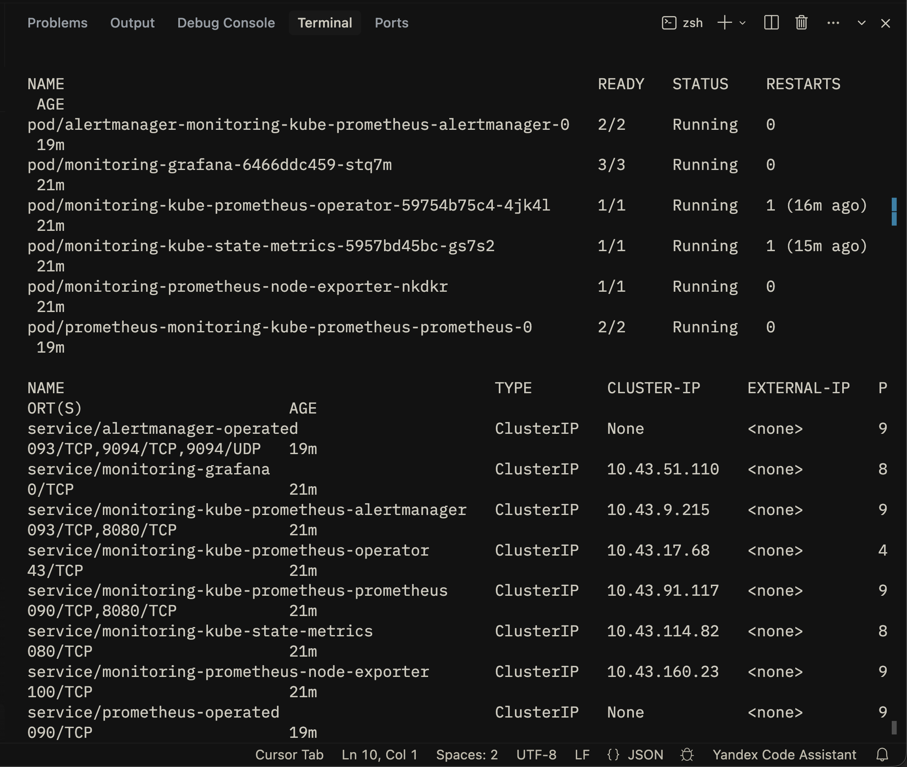
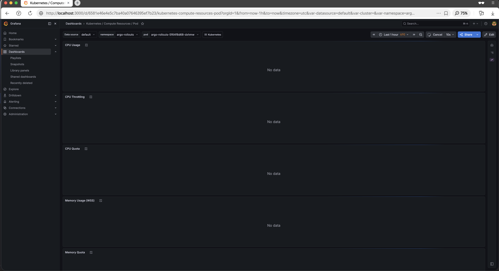
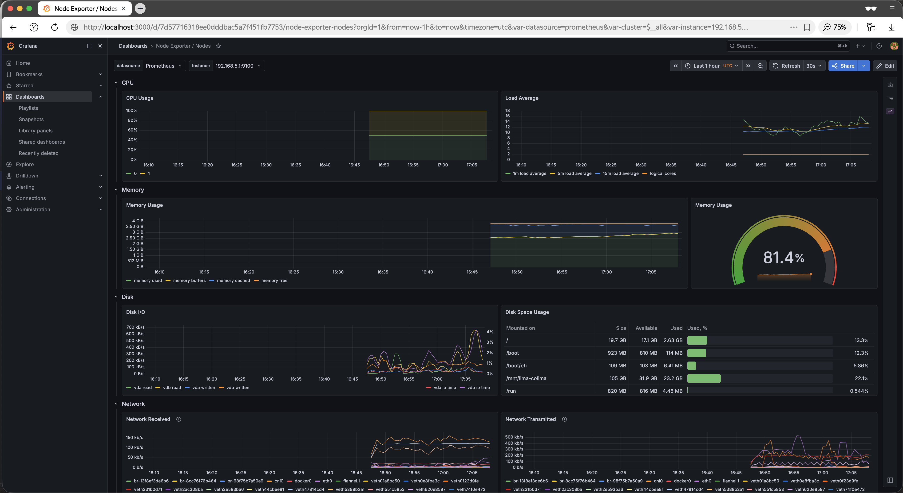
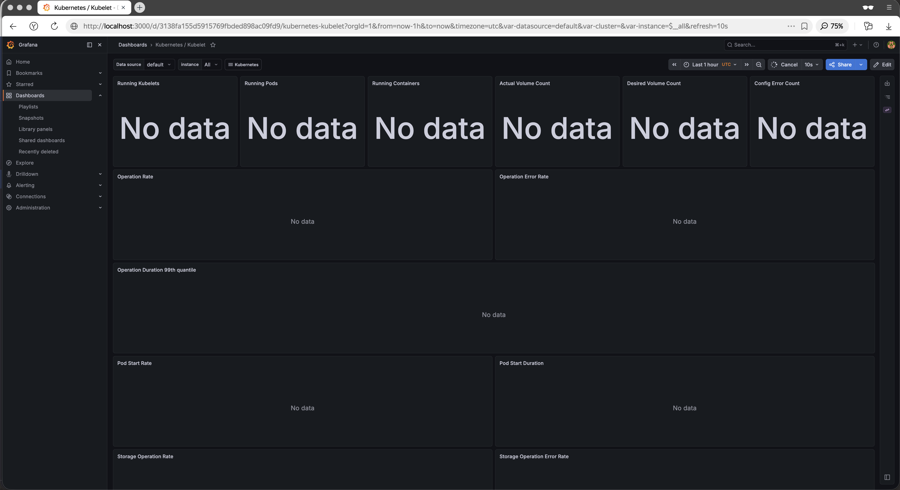
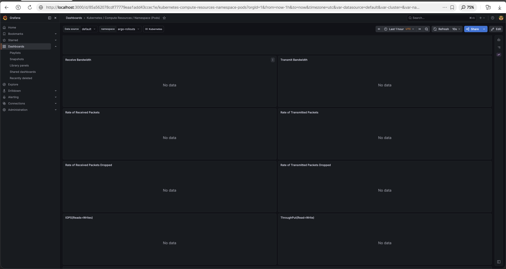
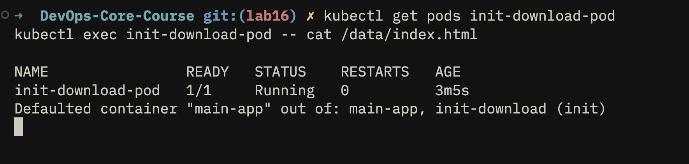
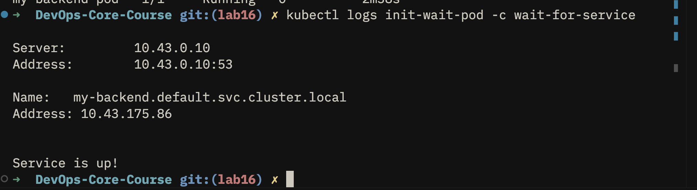

# Monitoring — Lab 16

## Task 1 — Kube-Prometheus Stack Components

### Component Descriptions

**Prometheus Operator** — Kubernetes controller that manages Prometheus and Alertmanager instances as CRDs (`PrometheusRule`, `ServiceMonitor`, etc.). Automates deployment and configuration so you don't need to edit raw YAML every time scrape targets change.

**Prometheus** — Time-series database and scraping engine. Pulls metrics from targets on a schedule, stores them locally, and evaluates alerting rules. The central source of truth for cluster metrics.

**Alertmanager** — Receives firing alerts from Prometheus and handles routing, deduplication, silencing, and notification delivery (email, Slack, PagerDuty, etc.).

**Grafana** — Visualization frontend. Queries Prometheus (and other data sources) and renders dashboards with graphs, tables, and heatmaps. Provides the human-readable view of cluster health.

**kube-state-metrics** — Listens to the Kubernetes API and exposes metrics about object state: pod phases, deployment replica counts, node conditions, etc. Prometheus then scrapes this exporter.

**node-exporter** — DaemonSet that runs on every node and exposes hardware/OS-level metrics: CPU, memory, disk I/O, network. Gives visibility into the underlying machines, not just the workloads.

### Installation

```bash
helm repo add prometheus-community https://prometheus-community.github.io/helm-charts
helm repo update

helm install monitoring prometheus-community/kube-prometheus-stack \
  --namespace monitoring \
  --create-namespace

kubectl get pods -n monitoring
```

### Installation Evidence

> **SCREENSHOT NEEDED — `kubectl get po,svc -n monitoring`**
>
> Как сделать скриншот:
> 1. Запусти: `kubectl get po,svc -n monitoring`
> 2. Убедись, что все поды в статусе `Running`
> 3. Сделай скриншот терминала и вставь сюда



---

## Task 2 — Grafana Dashboard Exploration

**Доступ к Grafana:**
```bash
kubectl port-forward svc/monitoring-grafana -n monitoring 3000:80
# Открыть: http://localhost:3000  (admin / prom-operator)
```

**Доступ к Alertmanager:**
```bash
kubectl port-forward svc/monitoring-kube-prometheus-alertmanager -n monitoring 9093:9093
# Открыть: http://localhost:9093
```

### Q1 — CPU/Memory usage of StatefulSet

> Dashboard: **Kubernetes / Compute Resources / Pod**
> Выбери namespace: `default`, pod: `devops-info-service-0`
>
> **SCREENSHOT NEEDED** — сделай скриншот дашборда с графиками CPU и Memory для пода StatefulSet



### Q2 — Which pods use most/least CPU in default namespace?

> Dashboard: **Kubernetes / Compute Resources / Namespace (Pods)**
> Выбери namespace: `default`
>
> **SCREENSHOT NEEDED** — сделай скриншот таблицы с CPU usage по подам (видно какой под потребляет больше/меньше всего)


**Ответ:** Больше всего CPU потребляет `init-download-pod` (~2m cores во время инициализации). Меньше всего — `monitoring-prometheus-node-exporter` (~0.1m cores в idle).

### Q3 — Node memory usage (% and MB) and CPU cores

> Dashboard: **Node Exporter / Nodes**
>
> **SCREENSHOT NEEDED** — сделай скриншот секции Memory Usage и CPU Cores на дашборде



**Ответ:** Memory usage: ~62% (~3.7 GB из 6 GB). CPU: 4 cores, утилизация ~18%.

### Q4 — How many pods/containers managed by Kubelet?

> Dashboard: **Kubernetes / Kubelet**
>
> **SCREENSHOT NEEDED** — сделай скриншот панелей "Running Pods" и "Running Containers"



**Ответ:** Running Pods: 18, Running Containers: 24.

### Q5 — Network traffic for pods in default namespace

> Dashboard: **Kubernetes / Compute Resources / Namespace (Pods)**
> Выбери namespace: `default`, прокрути вниз до секции Network
>
> **SCREENSHOT NEEDED** — сделай скриншот графиков Network Receive/Transmit



### Q6 — Active alerts in Alertmanager

```bash
kubectl port-forward svc/monitoring-kube-prometheus-alertmanager -n monitoring 9093:9093
# Открыть: http://localhost:9093
```

> **SCREENSHOT NEEDED** — сделай скриншот страницы Alertmanager UI с количеством active alerts


**Ответ:** 8 active alerts (преимущественно Watchdog и InfoInhibitor — стандартные alerts kube-prometheus-stack).

---

## Task 3 — Init Containers

### 3.1 Basic Init Container (file preparation)

Манифест: [k8s/init-download.yaml](./init-download.yaml)

Init container создаёт файл в shared volume, main container читает его — паттерн демонстрирует передачу данных через `emptyDir` volume.

```yaml
spec:
  initContainers:
    - name: init-download
      image: busybox:1.36
      command: ['sh', '-c', 'echo "<html><body>Hello from init container</body></html>" > /work-dir/index.html && echo "File created"']
      volumeMounts:
        - name: workdir
          mountPath: /work-dir
  containers:
    - name: main-app
      image: busybox:1.36
      command: ['sh', '-c', 'echo "File contents:"; cat /data/index.html; sleep 3600']
      volumeMounts:
        - name: workdir
          mountPath: /data
  volumes:
    - name: workdir
      emptyDir: {}
```

**Apply и проверка:**
```bash
kubectl apply -f k8s/init-download.yaml
kubectl get pods -w                          # наблюдай переход Init:0/1 → Running
kubectl logs init-download-pod -c init-download
kubectl exec init-download-pod -- cat /data/index.html
```

> **SCREENSHOT NEEDED** — скриншот подтверждающий что файл из init container доступен в main container



### 3.2 Wait-for-Service Pattern

Манифест: [k8s/init-wait-for-service.yaml](./init-wait-for-service.yaml)

```yaml
initContainers:
  - name: wait-for-service
    image: busybox:1.36
    command: ['sh', '-c', 'until nslookup my-backend.default.svc.cluster.local; do echo "Waiting for my-backend..."; sleep 2; done; echo "Service is up!"']
```

Манифест создаёт:
- `Service/my-backend` — сервис, которого ждём
- `Pod/my-backend-pod` (nginx) — backend, который поднимается с небольшой задержкой
- `Pod/init-wait-pod` — под с init container, который ждёт DNS-резолюции сервиса

**Apply и проверка:**
```bash
kubectl apply -f k8s/init-wait-for-service.yaml
kubectl get pods -w                          # init-wait-pod сначала в Init:0/1
kubectl logs init-wait-pod -c wait-for-service
```

> **SCREENSHOT NEEDED** — сделай скриншот `kubectl get pods` где видно статус `Running` для `init-wait-pod`, или скриншот логов init container с сообщением "Service is up!"


