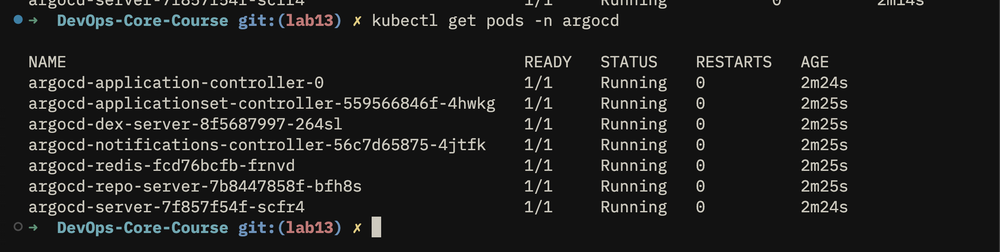
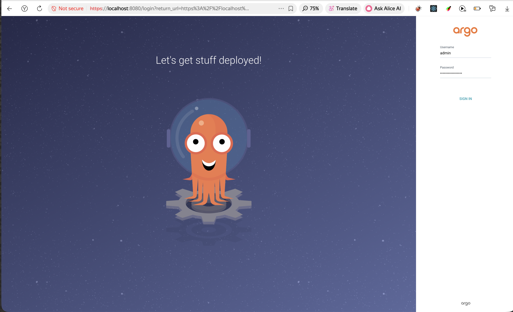
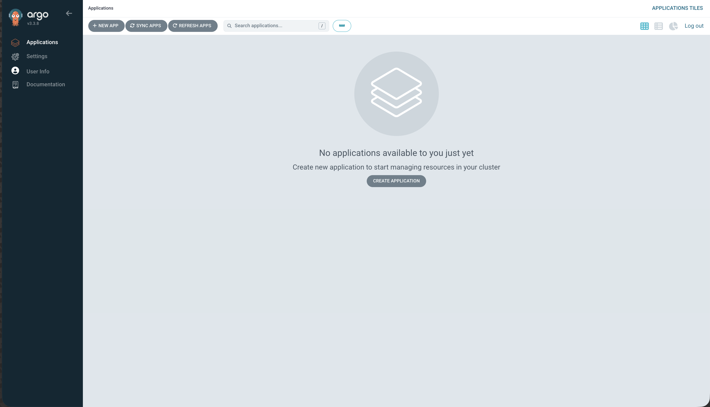
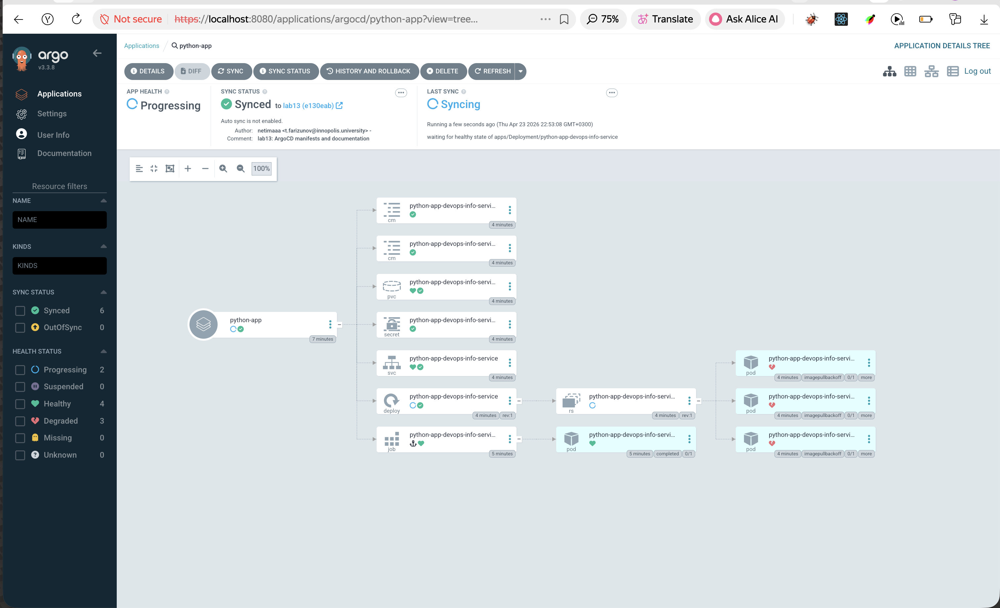

# Lab 14 — Argo Rollouts

## Argo Rollouts Setup

### Controller installation

```bash
kubectl create namespace argo-rollouts
kubectl apply -n argo-rollouts -f https://github.com/argoproj/argo-rollouts/releases/latest/download/install.yaml
kubectl get pods -n argo-rollouts
```

Expected result: the `argo-rollouts` controller pod is in `Running` status (`kubectl get pods -n argo-rollouts`).

### kubectl plugin installation

macOS:

```bash
brew install argoproj/tap/kubectl-argo-rollouts
kubectl argo rollouts version
```

### Dashboard installation and access

```bash
kubectl apply -n argo-rollouts -f https://github.com/argoproj/argo-rollouts/releases/latest/download/dashboard-install.yaml
kubectl port-forward svc/argo-rollouts-dashboard -n argo-rollouts 3100:3100
```

Dashboard URL: `http://localhost:3100`

### Rollout vs Deployment

`Rollout` is an extended alternative to `Deployment` for progressive delivery. Its pod template, selectors, replica management, probes, volumes, and resources remain almost identical to a regular `Deployment`, but the update mechanism is controlled through the `strategy` section.

Key differences:

- `Deployment` uses standard Kubernetes update strategies such as `RollingUpdate`.
- `Rollout` supports `canary` and `blueGreen` strategies.
- `Rollout` supports step-based promotion, pause points, abort, retry, and promotion commands.
- `Rollout` integrates with the Argo Rollouts dashboard and CLI for release management.
- `Rollout` can switch traffic between stable and new versions in a controlled way.

## Canary Deployment

### Implemented strategy

The Helm chart was converted from `Deployment` to `Rollout` in [`devops-info-service/templates/rollout.yaml`](devops-info-service/templates/rollout.yaml). The default strategy in [`devops-info-service/values.yaml`](devops-info-service/values.yaml) is canary.

Configured canary progression:

1. `20%` traffic, then manual pause.
2. `40%` traffic, then automatic pause for `30s`.
3. `60%` traffic, then automatic pause for `30s`.
4. `80%` traffic, then automatic pause for `30s`.
5. `100%` traffic.

### Deploy canary rollout

```bash
helm upgrade --install devops-info-service ./k8s/devops-info-service -n default
kubectl get rollout
kubectl argo rollouts get rollout devops-info-service-devops-info-service -w
```

### Trigger an update

Example with a new image tag:

```bash
helm upgrade --install devops-info-service ./k8s/devops-info-service \
  -n default \
  --set image.tag=1.0.1
```

### Promotion and rollback commands

Manual promotion from the first pause:

```bash
kubectl argo rollouts promote devops-info-service-devops-info-service
```

Abort during rollout:

```bash
kubectl argo rollouts abort devops-info-service-devops-info-service
```

Retry after abort:

```bash
kubectl argo rollouts retry rollout devops-info-service-devops-info-service
```

### Screenshots

Dashboard captures (`http://localhost:3100`, paths relative to this file in `k8s/`):



*Canary rollout paused at the first step (20% weight, waiting for manual promotion).*



*After `kubectl argo rollouts promote`, automatic steps with 30s pauses — capture during one of the intermediate weights.*



*After `kubectl argo rollouts abort …`, stable ReplicaSet serves traffic again.*

## Blue-Green Deployment

### Implemented strategy

Blue-green support is enabled through [`devops-info-service/values-bluegreen.yaml`](devops-info-service/values-bluegreen.yaml). The rollout uses:

- active service: [`devops-info-service/templates/service.yaml`](devops-info-service/templates/service.yaml)
- preview service: [`devops-info-service/templates/service-preview.yaml`](devops-info-service/templates/service-preview.yaml)
- manual promotion with `autoPromotionEnabled: false`

### Deploy blue-green rollout

```bash
helm upgrade --install devops-info-service ./k8s/devops-info-service \
  -n default \
  -f ./k8s/devops-info-service/values-bluegreen.yaml
```

### Trigger preview version

```bash
helm upgrade --install devops-info-service ./k8s/devops-info-service \
  -n default \
  -f ./k8s/devops-info-service/values-bluegreen.yaml \
  --set image.tag=1.0.1
```

### Access active and preview services

```bash
kubectl port-forward svc/devops-info-service-devops-info-service 8080:80
kubectl port-forward svc/devops-info-service-devops-info-service-preview 8081:80
```

- Active version: `http://localhost:8080`
- Preview version: `http://localhost:8081`

### Promote blue-green rollout

```bash
kubectl argo rollouts promote devops-info-service-devops-info-service
```

### Instant rollback after promotion

Unlike canary (where `abort` stops a stepped rollout), after blue-green **promotion** the new version is live on the active Service. Rollback means pointing the Rollout back at the previous stable image (or re-installing the previous Helm revision). Argo Rollouts then moves traffic on the **active** Service to the ReplicaSet for that template — effectively an immediate cutover, without intermediate percentages.

Example — switch active traffic back to the previous image tag:

```bash
helm upgrade --install devops-info-service ./k8s/devops-info-service \
  -n default \
  -f ./k8s/devops-info-service/values-bluegreen.yaml \
  --set image.tag=<previous-stable-tag>
```

**Compared to canary rollback:** canary `abort` reverts mid-flight through weighted steps; blue-green rollback after promotion is a single full switch via the active Service to whichever Pod template you apply—typically feels faster operationally because there are no 20/40/60/80% phases.

### Screenshots


*Preview stack is up; active Service still routes to the previous ReplicaSet until you promote.*



*Two browser windows or `curl` responses — production traffic vs preview.*


*After `kubectl argo rollouts promote`, the promoted ReplicaSet receives active Service traffic.*

## Strategy Comparison

### Canary

Pros:

- Safer progressive rollout with partial traffic exposure.
- Useful when a version should be observed gradually in production.
- Supports manual checkpoints before full rollout.

Cons:

- Slower release process.
- More operational steps during deployment.
- Mixed versions may coexist longer.

### Blue-Green

Pros:

- Fast switch between old and new version.
- Easy preview testing before promotion.
- Rollback is almost instant after promotion.

Cons:

- Requires duplicate capacity during rollout.
- No gradual traffic ramp-up.
- Needs an extra preview service.

### Recommendation

- Use canary for higher-risk application changes, new features, or cases where gradual exposure is important.
- Use blue-green for changes that require quick cutover, easy validation in preview, and fast rollback.

## CLI Commands Reference

```bash
kubectl get rollouts
kubectl argo rollouts get rollout devops-info-service-devops-info-service
kubectl argo rollouts get rollout devops-info-service-devops-info-service -w
kubectl argo rollouts dashboard
kubectl argo rollouts promote devops-info-service-devops-info-service
kubectl argo rollouts abort devops-info-service-devops-info-service
kubectl argo rollouts retry rollout devops-info-service-devops-info-service
kubectl describe rollout devops-info-service-devops-info-service
kubectl get rs
kubectl get svc
```

## Files Changed for Lab 14

- [`devops-info-service/templates/rollout.yaml`](devops-info-service/templates/rollout.yaml)
- [`devops-info-service/templates/service-preview.yaml`](devops-info-service/templates/service-preview.yaml)
- [`devops-info-service/templates/service.yaml`](devops-info-service/templates/service.yaml)
- [`devops-info-service/values.yaml`](devops-info-service/values.yaml)
- [`devops-info-service/values-bluegreen.yaml`](devops-info-service/values-bluegreen.yaml)
