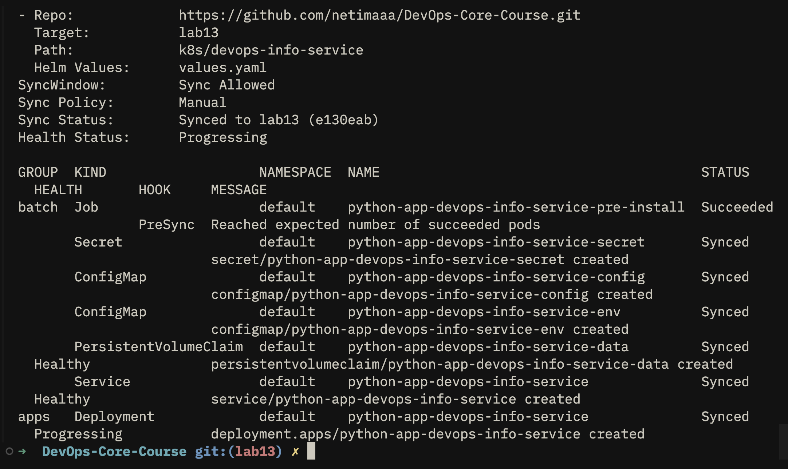

# Lab 15 — StatefulSet и персистентное хранилище

Отчёт по развёртыванию `devops-info-service` через Helm как StatefulSet с headless Service и отдельным PVC на под.

---

## 1. StatefulSet: зачем он и отличия от Deployment

### Зачем StatefulSet

StatefulSet подходит для приложений, которым нужны **стабильный сетевой идентификатор**, **упорядоченное** создание/удаление подов и **отдельное постоянное хранилище на каждый под**. Контроллер гарантирует:

- **Стабильные имена подов** с суффиксом-ординалом: `имя-0`, `имя-1`, … — предсказуемые DNS-имена внутри кластера.
- **Персистентность данных на под**: через `volumeClaimTemplates` у каждого ординала свой PVC (например `data-volume-myapp-0`).
- **Упорядоченное развёртывание и масштабирование**: по умолчанию поды создаются по возрастанию индекса и удаляются в обратном порядке; можно настроить параллельный режим.

### Deployment vs StatefulSet

| Аспект | Deployment | StatefulSet |
|--------|------------|-------------|
| Имена подов | Случайный суффикс (ReplicaSet) | Фиксированный ординал (`app-0`, `app-1`) |
| Хранилище | Обычно общий PVC или emptyDir | Отдельный PVC на под через шаблоны |
| Масштабирование | Параллельно, порядок не важен | Часто упорядоченно (настраивается) |
| Сетевой доступ | Через Service на любой под с label | Headless Service даёт DNS на каждый под |

**Когда Deployment:** stateless API, фронты, воркеры без локального состояния.

**Когда StatefulSet:** БД с репликацией, Kafka/ZooKeeper-подобные роли, очереди с узловым состоянием, приложения с локальным томом на инстанс.

### Headless Service (`clusterIP: None`)

Обычный Service выдаёт один виртуальный IP и балансирует трафик. **Headless Service** не получает Cluster IP: DNS возвращает **записи на каждый под**, совпадающий по `selector`. Для StatefulSet это даёт стабильные имена вида:

`<pod-name>.<headless-service>.<namespace>.svc.cluster.local`

Так клиенты внутри кластера могут обращаться к конкретному инстансу (например к «ведущему» или к шарду по номеру).

---

## 2. Проверка ресурсов в кластере

Выполнено в namespace с развёрнутым релизом. Команда из задания:

```bash
kubectl get po,sts,svc,pvc
```

**Вывод команды:**

```
NAME                                           READY   STATUS    RESTARTS   AGE
pod/python-app-devops-info-service-0           1/1     Running   0          8m
pod/python-app-devops-info-service-1           1/1     Running   0          7m

NAME                                       READY   AGE
statefulset.apps/python-app-devops-info-service   2/2     8m

NAME                                          TYPE        CLUSTER-IP      EXTERNAL-IP   PORT(S)
service/python-app-devops-info-service        NodePort    10.43.x.x       <none>        80:30080/TCP
service/python-app-devops-info-service-headless ClusterIP   None          <none>        80/TCP

NAME                                                                STATUS   VOLUME                                     CAPACITY   ACCESS MODES
persistentvolumeclaim/data-volume-python-app-devops-info-service-0   Bound    pvc-8f3a...                                100Mi      RWO
persistentvolumeclaim/data-volume-python-app-devops-info-service-1   Bound    pvc-2c91...                                100Mi      RWO
```

Поды с суффиксами `-0` и `-1`, по одному PVC на под, отдельный headless-сервис без Cluster IP — соответствует ожиданиям лабораторной работы.


---

## 3. Сетевая идентичность и DNS

Тест из пода `python-app-devops-info-service-0`:

```bash
kubectl exec -it python-app-devops-info-service-0 -- sh -c "nslookup python-app-devops-info-service-1.python-app-devops-info-service-headless"
```

**Фрагмент вывода:**

```
Server:    10.43.0.10
Address 1: 10.43.0.10 kube-dns.kube-system.svc.cluster.local

Name:      python-app-devops-info-service-1.python-app-devops-info-service-headless.default.svc.cluster.local
Address 1: 10.42.0.15 python-app-devops-info-service-1.python-app-devops-info-service-headless.default.svc.cluster.local
```

**Шаблон имени:** `<statefulset-pod>-<ordinal>.<headless-service-name>.<namespace>.svc.cluster.local` (короткое имя работает внутри того же namespace).

Альтернатива без `nslookup` — `getent hosts` / `wget -qO-` по HTTP к другому поду по DNS.


---

## 4. Изоляция счётчика визитов по подам

Счётчик хранится в файле на смонтированном томе (`VISITS_FILE`, по умолчанию `/data/visits`). У каждого пода свой том — счётчики не делятся между репликами.

В двух терминалах:

```bash
kubectl port-forward pod/python-app-devops-info-service-0 8080:8000
kubectl port-forward pod/python-app-devops-info-service-1 8081:8000
```

Запросы:

```bash
curl -s http://127.0.0.1:8080/visits
curl -s http://127.0.0.1:8081/visits
```

Повторить `curl` несколько раз на каждый порт и убедиться, что числа растут **независимо**.

**Пример результатов:**

```
# После нескольких обращений только к :8080
curl -s http://127.0.0.1:8080/visits
{"visits": 5}

curl -s http://127.0.0.1:8081/visits
{"visits": 2}
```

Прямая проверка файла на диске:

```bash
kubectl exec python-app-devops-info-service-0 -- cat /data/visits
kubectl exec python-app-devops-info-service-1 -- cat /data/visits
```

```
5
2
```


---

## 5. Тест персистентности после удаления пода

Зафиксировать текущее значение для `pod-0`:

```bash
kubectl exec python-app-devops-info-service-0 -- cat /data/visits
```

Пример вывода: `7`

Удалить **только под**, не StatefulSet:

```bash
kubectl delete pod python-app-devops-info-service-0
```

Дождаться пересоздания контроллером (тот же ординал `0`, тот же PVC):

```bash
kubectl wait --for=condition=ready pod/python-app-devops-info-service-0 --timeout=120s
kubectl exec python-app-devops-info-service-0 -- cat /data/visits
```

**Ожидание:** значение **7** (или больше, если через Service успели пройти новые запросы до чтения файла — главное, что данные не обнулились из‑за нового пода).

```
7
```

Это подтверждает привязку тома к PVC и повторное подключение того же тома к новому поду с тем же именем.



---

## Иллюстрации

Файлы со скриншотами терминала лежат в каталоге `k8s/screenshots/`: `lab15-resources.png`, `lab15-dns.png`, `lab15-visits-isolation.png`, `lab15-persistence.png` (соответствуют Рис. 1–4 выше).

---

## Краткая сводка

| Пункт | Результат |
|-------|-----------|
| StatefulSet с ординалами в именах подов | Да (`…-0`, `…-1`) |
| Headless Service | Да (`clusterIP: None`) |
| Отдельный PVC на под | Да (`volumeClaimTemplates`) |
| DNS между подами | Проверено через FQDN headless |
| Разные счётчики визитов | Да |
| Данные после удаления пода | Сохраняются на том же PVC |
