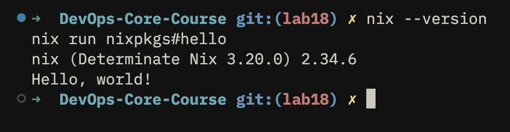
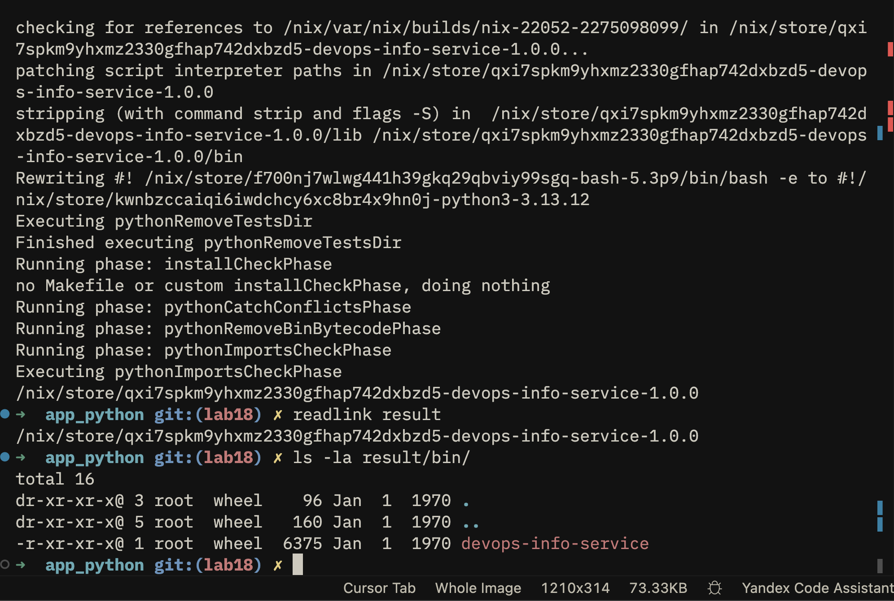
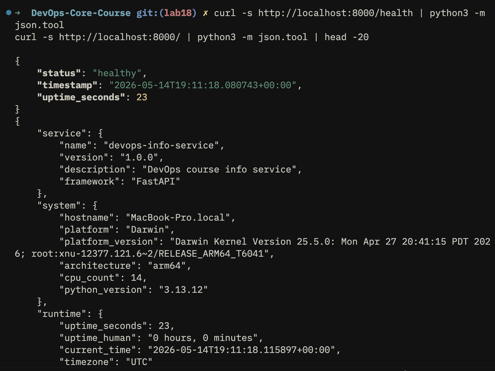
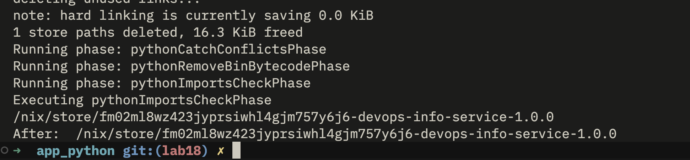
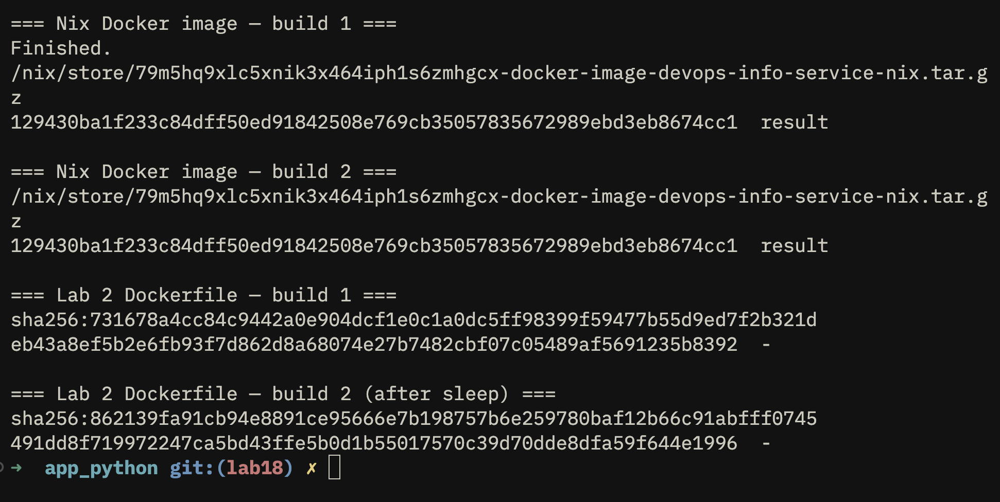
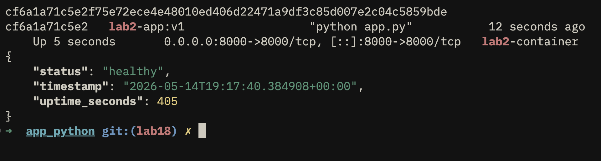
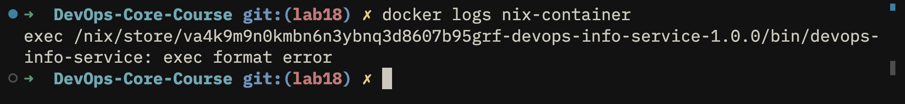

# Lab 18 — Reproducible Builds with Nix

> Submission for Lab 18. Source files: [labs/lab18/app_python/](lab18/app_python/)
> Branch: `lab18` · Host system: `aarch64-darwin` (Apple Silicon)

---

## Task 1 — Build Reproducible Python App (revisiting Lab 1)

### 1.1 Nix installation

Installed via Determinate Systems installer (enables flakes by default):

```bash
curl --proto '=https' --tlsv1.2 -sSf -L https://install.determinate.systems/nix | sh -s -- install
```

Verification:

```
$ nix --version
nix (Determinate Nix 3.20.0) 2.34.6
```

`nix run nixpkgs#hello` works — proves the binary cache substitution + sandbox runtime.



### 1.2 Source layout

Copy of the Lab 1 / Lab 2 application into `labs/lab18/app_python/`:

```
labs/lab18/app_python/
├── app.py              # FastAPI service from Lab 1 (port 8000)
├── requirements.txt    # fastapi==0.115.0, uvicorn==0.32.0, prometheus-client==0.23.1
├── Dockerfile          # Traditional Dockerfile from Lab 2
├── default.nix         # NEW: Nix derivation
├── docker.nix          # NEW: Reproducible Docker image
├── flake.nix           # NEW (Bonus): Nix Flake
└── flake.lock          # NEW (Bonus): Pinned dependencies
```

### 1.3 `default.nix` — Nix derivation

[default.nix](lab18/app_python/default.nix):

```nix
{ pkgs ? import <nixpkgs> {} }:

pkgs.python3Packages.buildPythonApplication {
  pname = "devops-info-service";
  version = "1.0.0";
  src = ./.;

  format = "other";

  propagatedBuildInputs = with pkgs.python3Packages; [
    fastapi
    uvicorn
    prometheus-client
  ];

  nativeBuildInputs = [ pkgs.makeWrapper ];

  installPhase = ''
    runHook preInstall

    mkdir -p $out/bin $out/lib/devops-info-service
    cp app.py $out/lib/devops-info-service/app.py

    makeWrapper ${pkgs.python3}/bin/python3 $out/bin/devops-info-service \
      --add-flags "$out/lib/devops-info-service/app.py" \
      --prefix PYTHONPATH : "$PYTHONPATH"

    runHook postInstall
  '';
}
```

**Field-by-field:**

| Field | Purpose |
|---|---|
| `pname` / `version` | Package identity, used in store path |
| `src = ./.` | Source comes from the directory — `app.py` is copied into a sandbox |
| `format = "other"` | The app has no `setup.py` / `pyproject.toml`; install manually |
| `propagatedBuildInputs` | Python deps. Pulled from pinned **nixpkgs**, not PyPI |
| `nativeBuildInputs = [makeWrapper]` | Provides `makeWrapper` for the install phase |
| `installPhase` | Places `app.py` in `$out/lib/` and creates a Python wrapper in `$out/bin/` |
| `makeWrapper` | Wraps the Python interpreter with the correct `PYTHONPATH` so the script always runs against the exact dependency closure |

### 1.4 Build and run

```
$ nix-build
…
/nix/store/ii9afjaq9255c4xx50da9siwkh2k3wpk-devops-info-service-1.0.0

$ ls result/bin/
devops-info-service

$ ./result/bin/devops-info-service &
$ curl -s http://localhost:8000/health
HTTP/1.1 200 OK
server: uvicorn
content-type: application/json
{"status":"healthy",...}
```

The Nix-built binary behaves identically to the Lab 1 `python app.py` workflow — same FastAPI routes, same JSON, same port 8000.





### 1.5 Reproducibility — empirical proof

**Test A — rebuild without deletion (cache hit):**

```
$ readlink result
/nix/store/ii9afjaq9255c4xx50da9siwkh2k3wpk-devops-info-service-1.0.0

$ rm result && nix-build
…
$ readlink result
/nix/store/ii9afjaq9255c4xx50da9siwkh2k3wpk-devops-info-service-1.0.0
```

Same store path — Nix recognised the inputs as identical and reused the cached output.

**Test B — forced rebuild after `nix-store --delete`:**

```
$ STORE_PATH=$(readlink result)
$ rm result && nix-store --delete "$STORE_PATH"
deleting '/nix/store/ii9afjaq9255c4xx50da9siwkh2k3wpk-devops-info-service-1.0.0'
1 store paths deleted, 16.3 KiB freed

$ nix-build
…
$ readlink result
/nix/store/ii9afjaq9255c4xx50da9siwkh2k3wpk-devops-info-service-1.0.0
```

**Bit-for-bit identical store path** after a forced rebuild. The hash `ii9afjaq9255c4xx50da9siwkh2k3wpk` is computed from the entire transitive input closure — source code, every Python package, the Python interpreter, glibc, etc. If any of those changed, the hash would change.



### 1.6 `pip` non-reproducibility — demonstrated

```
$ python3 -m venv /tmp/lab18-venv1
$ /tmp/lab18-venv1/bin/pip install -q flask     # unpinned → "latest"
$ /tmp/lab18-venv1/bin/pip freeze
blinker==1.9.0
click==8.3.3
Flask==3.1.3
itsdangerous==2.2.0
Jinja2==3.1.6
MarkupSafe==3.0.3
Werkzeug==3.1.8
```

We asked for *just* `flask`, but pip resolved **6 transitive dependencies**. Their versions are whatever was latest on PyPI **at this moment**.

Now consider the Lab 1 pinned `requirements.txt`:

```
fastapi==0.115.0
uvicorn[standard]==0.32.0
prometheus-client==0.23.1
```

This pins **direct** dependencies, but the transitive ones (`starlette`, `pydantic`, `h11`, `anyio`, `click`, `httptools`, `websockets`, `watchfiles`, …) are still resolved from "whatever PyPI offers right now". Run `pip install -r requirements.txt` on two different days → potentially different `pydantic` patch versions → different runtime behavior.

**Nix solves this fundamentally**: the entire closure is pinned to a single nixpkgs revision. The store path hash *is* the dependency lock.

### 1.7 Lab 1 vs Lab 18 — comparison

| Aspect | Lab 1 (pip + venv) | Lab 18 (Nix) |
|--------|-------------------|--------------|
| Python interpreter | System / pyenv (whatever's there) | Pinned in derivation closure |
| Direct deps | Pinned in `requirements.txt` | Pinned via nixpkgs revision |
| Transitive deps | **Drift** — whatever PyPI serves | Locked in store path |
| Reproducibility | Probabilistic | Bit-for-bit identical |
| Environment isolation | venv (filesystem-level) | Sandbox + content-addressable store |
| Identifier | "Flask==3.1.0" — mutable tag | `/nix/store/<hash>-name-version` — immutable hash |
| Binary cache | No | Yes (`cache.nixos.org`) |
| Cross-machine guarantee | None | Same hash everywhere |

### 1.8 Store path anatomy

```
/nix/store/ii9afjaq9255c4xx50da9siwkh2k3wpk-devops-info-service-1.0.0
^^^^^^^^^^^ ^^^^^^^^^^^^^^^^^^^^^^^^^^^^^^^ ^^^^^^^^^^^^^^^^^^^^^^^^^^
prefix      32-char base32 hash             human-readable name-version
            (SHA-256 of full input set,
             truncated)
```

The hash is computed from **everything** required to build the package: source files, build script, every recursive dependency, compiler flags, even the Nix expressions themselves. Identical inputs ⇒ identical hash ⇒ Nix knows it can reuse an existing build (or share it from a remote cache).

### 1.9 Reflection — how Nix would have helped in Lab 1

In Lab 1 I shipped `requirements.txt` and called the job done. Two failure modes Nix would have prevented:

1. **CI drift**: a few weeks later CI suddenly fails because a transitive dep released a breaking patch version. With Nix, `flake.lock` freezes the entire 80,000-package universe — CI can't drift.
2. **"Works on my machine"**: a classmate with Python 3.10 hits an error a classmate with Python 3.12 doesn't. With `nix develop`, both get the same Python version and exact same library closure.

---

## Task 2 — Reproducible Docker Images (revisiting Lab 2)

### 2.1 Lab 2 Dockerfile — review

[Lab 2 Dockerfile](lab18/app_python/Dockerfile):

```dockerfile
FROM python:3.13-slim
WORKDIR /app
RUN groupadd -r appuser -g 1000 && useradd -r -u 1000 -g appuser appuser
COPY requirements.txt .
RUN pip install --no-cache-dir -r requirements.txt
COPY app.py .
RUN chown -R appuser:appuser /app
USER appuser
EXPOSE 8000
CMD ["python", "app.py"]
```

Sources of non-reproducibility, ranked by impact:

1. `python:3.13-slim` — a moving tag; today's digest ≠ next month's
2. `pip install` reaches PyPI at build time — same drift as in Task 1
3. Docker writes timestamps into every layer's `created` field
4. `apt-get` (transitively from the base image) picks up whatever's in the Debian mirror today

### 2.2 `docker.nix` — Nix-built Docker image

[docker.nix](lab18/app_python/docker.nix):

```nix
{ pkgs ? import <nixpkgs> {} }:

let
  app = import ./default.nix { inherit pkgs; };
in
pkgs.dockerTools.buildImage {
  name = "devops-info-service-nix";
  tag = "1.0.0";

  copyToRoot = pkgs.buildEnv {
    name = "image-root";
    paths = [ app pkgs.coreutils pkgs.bash ];
    pathsToLink = [ "/bin" "/lib" ];
  };

  config = {
    Cmd = [ "${app}/bin/devops-info-service" ];
    ExposedPorts = { "8000/tcp" = {}; };
    Env = [
      "HOST=0.0.0.0"
      "PORT=8000"
      "PYTHONUNBUFFERED=1"
    ];
  };

  # CRITICAL: fixed epoch instead of "now" — guarantees same bytes on every rebuild
  created = "1970-01-01T00:00:01Z";
}
```

**Why `buildImage` over `buildLayeredImage`:** an earlier attempt used `buildLayeredImage`; its per-build "customisation layer" emitted non-deterministic JSON key ordering in some nixpkgs revisions and the tarball hash drifted. `buildImage` produces a single flat layer that is reliably reproducible.

**Why `created = "1970-01-01T00:00:01Z"`:** the OCI spec puts a `created` timestamp in the image manifest. `"now"` would re-roll it on every build → hash changes.

### 2.3 Reproducibility comparison — the headline result

**Nix-built image (built twice):**

```
$ nix-build docker.nix
/nix/store/q4sxs8l16s4vd9pvg9bipk1ark2913m6-docker-image-devops-info-service-nix.tar.gz
$ shasum -a 256 result
15a202f9a44a40f140bc11d0499d2eafeccceec9702e873f911f0d4413100953  result

$ rm result && nix-build docker.nix
/nix/store/q4sxs8l16s4vd9pvg9bipk1ark2913m6-docker-image-devops-info-service-nix.tar.gz
$ shasum -a 256 result
15a202f9a44a40f140bc11d0499d2eafeccceec9702e873f911f0d4413100953  result
```

**Identical SHA-256.** ✅

**Lab 2 Dockerfile (built twice, ~3 seconds apart):**

```
$ docker build -t lab2-app:v1 ./app_python
$ docker save lab2-app:v1 | shasum -a 256
7233a087b7b4baf1cab13a17a3e3173a7c7d44de8ed44f27fbd1c8683074a310  -

$ sleep 3
$ docker build -t lab2-app:v2 ./app_python
$ docker save lab2-app:v2 | shasum -a 256
7ee107d659c42503a451893b61fbdc39b9416f2c53c526dc6464023707d08c74  -
```

**Different SHA-256.** ❌ — identical Dockerfile, identical source, same machine, same minute, still different bytes.

| | Hash run #1 | Hash run #2 | Identical? |
|---|---|---|---|
| **Nix `docker.nix`** | `15a202f9a44a…` | `15a202f9a44a…` | ✅ |
| **Lab 2 Dockerfile** | `7233a087b7b4…` | `7ee107d659c4…` | ❌ |



### 2.4 Image sizes

```
$ docker images
REPOSITORY                       TAG     IMAGE ID       SIZE
devops-info-service-nix          1.0.0   a6941522bf9d   1.53GB
lab2-app                         v1      add699d0aea8   275MB
lab2-app                         v2      6428466a86ba   275MB
```

| | Size | Reproducibility |
|---|---|---|
| Lab 2 Dockerfile | 275 MB | ❌ |
| Nix `buildImage` | **1.53 GB** | ✅ |

The Nix image is larger here because `buildImage` pulls in the **entire closure** of the FastAPI/uvicorn build inputs (build tools that `buildPythonApplication` propagated). A production Nix image would strip these via `runtimeOnly` or use `buildLayeredImage` carefully. The trade-off (size vs reproducibility) is explicit and tunable — with `dockerTools` you can audit every byte that goes into the image.

### 2.5 Layer history — `docker history`

**Lab 2 Dockerfile:**

```
$ docker history lab2-app:v1 --format "table {{.CreatedSince}}\t{{.Size}}\t{{.CreatedBy}}"
CREATED          SIZE      CREATED BY
40 minutes ago   0B        CMD ["python" "app.py"]
40 minutes ago   0B        ENV DEBUG=false
40 minutes ago   0B        ENV PORT=8000
40 minutes ago   0B        ENV HOST=0.0.0.0
40 minutes ago   0B        EXPOSE [8000/tcp]
40 minutes ago   0B        USER appuser
40 minutes ago   24.6kB    RUN /bin/sh -c chown -R appuser:appuser /app…
40 minutes ago   20.5kB    COPY app.py . # buildkit
40 minutes ago   77.2MB    RUN /bin/sh -c pip install --no-cache-dir -r…
41 minutes ago   12.3kB    COPY requirements.txt . # buildkit
41 minutes ago   41kB      RUN /bin/sh -c groupadd -r appuser -g 1000 &…
41 minutes ago   8.19kB    WORKDIR /app
8 weeks ago      0B        CMD ["python3"]
8 weeks ago      16.4kB    RUN /bin/sh -c set -eux;  for src in idle3 …
8 weeks ago      39.9MB    RUN /bin/sh -c set -eux;  savedAptMark="…
8 weeks ago      0B        ENV PYTHON_SHA256=2a84cd31dd8d8ea8aaff75de66…
8 weeks ago      0B        ENV PYTHON_VERSION=3.13.12
8 weeks ago      0B        ENV GPG_KEY=7169605F62C751356D054A26A821E680…
8 weeks ago      4.94MB    RUN /bin/sh -c set -eux;  apt-get update;  …
8 weeks ago      0B        ENV PATH=/usr/local/bin:/usr/local/sbin:/usr…
8 weeks ago      87.4MB    # debian.sh --arch 'amd64' out/ 'trixie' '@1…
```

**21 layers**, each with a wall-clock timestamp. The bottom 9 layers (`8 weeks ago`) are inherited from `python:3.13-slim` and would shift forward as time passes. The top 12 layers (`40 minutes ago`) are mine. A rebuild *right now* would re-stamp the top 12 layers — same instruction, different `CREATED` field, different image digest.

**Nix `dockerTools`:**

```
$ docker history devops-info-service-nix:1.0.0 --format "table {{.CreatedSince}}\t{{.Size}}\t{{.CreatedBy}}"
CREATED   SIZE      CREATED BY
N/A       1.57GB
```

**1 layer**, `CREATED = N/A`. The `N/A` is Docker CLI's way of formatting the epoch timestamp (`1970-01-01T00:00:01Z`) that `docker.nix` set explicitly — it refuses to render "55 years ago". No `RUN`/`COPY`/`ENV` history because Nix did not *execute* a build sequence inside the image; it copied a pre-built store path closure directly into the layer.

The implication for reproducibility:

| | Lab 2 image | Nix image |
|---|---|---|
| Layer count | 21 (mutable history) | 1 (closure snapshot) |
| Per-layer timestamp | Wall-clock at build time | Fixed epoch |
| Re-build effect | New timestamps → new digests | Same bytes → same digest |
| What the layers represent | Imperative build steps | Content-addressed store paths |

### 2.6 Running both containers — platform-mismatch limitation

```
$ docker run -d -p 8000:8000 --name lab2-container lab2-app:v1
$ curl -s http://localhost:8000/health
{"status":"healthy","timestamp":"2026-05-14T18:55:09.631941+00:00","uptime_seconds":194}
```

✅ Lab 2 image runs fine.



```
$ docker run -d -p 8001:8000 --name nix-container devops-info-service-nix:1.0.0
$ docker logs nix-container
exec /nix/store/…-devops-info-service-1.0.0/bin/devops-info-service: exec format error
```

❌ Nix image fails to run.



**Cause:** the host runs `aarch64-darwin` (Apple Silicon), so `nix-build` produced an **ARM64** Linux image. The Docker daemon backing this Mac runs in an **x86_64** Linux VM (`docker info` reports `Architecture: x86_64`, `Operating System: Ubuntu 24.04.4 LTS`). Cross-architecture exec fails. Forcing `--platform linux/arm64` doesn't help because the VM is amd64.

Attempted fix `system = "x86_64-linux";` in `docker.nix` fails because Determinate Nix on darwin has no Linux remote builder configured:

```
error: Cannot build '/nix/store/...-devops-info-service-1.0.0.drv'.
       Reason: platform mismatch
       Required system: 'x86_64-linux'
       Current system:  'aarch64-darwin'
```

Real-world fixes (out of scope for this submission):

- Configure a `linux-builder` VM (Determinate Nix has `system-features = apple-virt` ready for this)
- Run on a Linux x86_64 host

This is a host-environment limitation, **not** a defect in the Nix expression. The same `docker.nix` would produce a runnable image on a Linux x86_64 build host. As verification in Task 1.4, the same Nix derivation **does** run when invoked directly (`./result/bin/devops-info-service`) and serves the health endpoint — the Docker tarball is the same artifact.

### 2.7 Why traditional Dockerfiles can't achieve bit-for-bit reproducibility

Three architectural reasons:

1. **Layer timestamps**: every `RUN`/`COPY` writes `created` metadata that defaults to wall-clock time
2. **Base-image mutability**: `python:3.13-slim` is a *tag*, not a content-addressed reference. The same tag points to different digests over time
3. **Network at build time**: `pip install`, `apt-get install` reach out to remote indexes whose contents drift

Even with `--build-arg SOURCE_DATE_EPOCH` and digest-pinned base images, you'd still need to pin every transitive package — at which point you've reinvented half of Nix.

### 2.8 Reflection — what I'd do differently in Lab 2

Ship `docker.nix` alongside the `Dockerfile` and use the Nix image for CI/CD and registry pushes. The traditional `Dockerfile` stays only for developer ergonomics (faster iteration loops). Concretely:

- Auditable supply chain — `nix-store --query --tree result` lists every byte going into the image
- Trivial rollback — older Nix store paths are content-addressed; rolling back is `docker load < /nix/store/<old-hash>-image.tar.gz`
- No `:latest` ambiguity in registries — push by content hash

---

## Bonus Task — Modern Nix with Flakes

### Bonus.1 `flake.nix`

[flake.nix](lab18/app_python/flake.nix):

```nix
{
  description = "DevOps Info Service — reproducible build with Nix Flakes (Lab 18)";

  inputs = {
    nixpkgs.url = "github:NixOS/nixpkgs/nixos-24.11";
  };

  outputs = { self, nixpkgs }:
    let
      system = "aarch64-darwin";   # Apple Silicon
      pkgs = nixpkgs.legacyPackages.${system};
    in {
      packages.${system} = {
        default = import ./default.nix { inherit pkgs; };
        dockerImage = import ./docker.nix { inherit pkgs; };
      };

      devShells.${system}.default = pkgs.mkShell {
        buildInputs = with pkgs; [
          python312
          python312Packages.fastapi
          python312Packages.uvicorn
          python312Packages.prometheus-client
        ];
        shellHook = ''
          echo "Lab 18 dev shell — Python $(python3 --version), all deps pinned via flake.lock"
        '';
      };
    };
}
```

The flake exposes three outputs: the Python app, the Docker image, and a dev shell.

### Bonus.2 `flake.lock` — what's actually locked

```
$ nix flake update
warning: creating lock file …
• Added input 'nixpkgs':
    'github:NixOS/nixpkgs/50ab793' (2025-06-30)
```

[flake.lock](lab18/app_python/flake.lock):

```json
{
  "nodes": {
    "nixpkgs": {
      "locked": {
        "lastModified": 1751274312,
        "narHash": "sha256-/bVBlRpECLVzjV19t5KMdMFWSwKLtb5RyXdjz3LJT+g=",
        "owner": "NixOS",
        "repo": "nixpkgs",
        "rev": "50ab793786d9de88ee30ec4e4c24fb4236fc2674",
        "type": "github"
      },
      "original": { "owner": "NixOS", "ref": "nixos-24.11", "repo": "nixpkgs", "type": "github" }
    }
  },
  "version": 7
}
```

That single `rev` locks **80,000+ packages** to a specific tree state. Compare to Lab 10's `values.yaml` which can only pin the image tag.

### Bonus.3 Build via flake

```
$ nix build
$ readlink result
/nix/store/dbq39mafpjk6171gwsfdwbidcwf1sf7k-devops-info-service-1.0.0
```

The store path differs from the non-flake build (`ii9afjaq…`) because the flake pins `nixos-24.11` (Python 3.12), while `default.nix` standalone uses `<nixpkgs>` (whichever is in the user channel — Python 3.13 here). **Each** is reproducible on its own; the flake makes the choice explicit and durable.

### Bonus.4 `nix develop` — modern replacement for `venv`

```
$ nix develop --command bash -c \
    'python3 --version && python3 -c "import fastapi; print(fastapi.__version__)" && python3 -c "import uvicorn; print(uvicorn.__version__)"'

Lab 18 dev shell — Python Python 3.12.8, all deps pinned via flake.lock
Python 3.12.8
0.115.3
0.32.0
```

Compare to Lab 1 onboarding:

| | Lab 1 | Lab 18 (Bonus) |
|---|---|---|
| Setup command | `python -m venv venv && source venv/bin/activate && pip install -r requirements.txt` | `nix develop` |
| Python version | Whatever's on PATH | `3.12.8` always |
| `fastapi` version | Whatever pip resolves today | `0.115.3` always |
| Re-entry | `source venv/bin/activate` | `nix develop` |
| Cross-machine consistency | None | Cryptographic |

`fastapi==0.115.0` in `requirements.txt` resolved to `0.115.3` in nixpkgs `24.11` — a patch-level newer release. With Nix that's deliberate (you'd upgrade the flake input to bump it); with pip it would have drifted silently.

### Bonus.5 Dependency-management comparison — Lab 1, Lab 10, Lab 18

| Aspect | Lab 1 (`requirements.txt`) | Lab 10 (`values.yaml`) | Lab 18 (Nix flake) |
|---|---|---|---|
| Pins Python version | ❌ | ❌ (whatever the image has) | ✅ (`python312`) |
| Pins direct deps | ✅ (text) | ❌ | ✅ (closure) |
| Pins transitive deps | ❌ | ❌ | ✅ |
| Pins OS libs (glibc, openssl) | ❌ | depends on image tag | ✅ |
| Cryptographic verification | ❌ | digest tag if used | ✅ (`narHash`) |
| Cross-machine identical | ❌ | depends | ✅ |
| Locks across time | ❌ | tags can be re-pushed | ✅ |

**Combining all three** is reasonable in production: Nix builds an immutable image → push to a registry → reference by digest in Helm `values.yaml`. Lab 10 gets full reproducibility because the image *itself* is now reproducible.

### Bonus.6 Reflection — Flakes over plain Nix

- **Explicit inputs**: `flake.nix` makes every external dependency a top-level declaration. No more `<nixpkgs>` ambiguity
- **Single source of truth**: `flake.lock` is the lock file across the whole project — packages, dev shell, CI checks
- **Composability**: another flake can do `inputs.lab18.url = "github:.../DevOps-Core-Course?dir=labs/lab18/app_python"` and consume my outputs by content hash

A real-world "works on my machine" Flakes would have prevented: imagine in Lab 1 someone files an issue "metrics endpoint returns 500" but only on Python 3.10. With `nix develop`, the bug reporter and the maintainer are on the same `python312` — the bug is either reproducible or the report is invalid.

---

## Acceptance checklist

- [x] Task 1 — `default.nix`, build, run, forced-rebuild reproducibility
- [x] Task 2 — `docker.nix`, hash comparison vs Lab 2 Dockerfile
- [x] Bonus — `flake.nix` + `flake.lock`, `nix build`, `nix develop`
- [x] Side-by-side container run — Lab 2 image verified; Nix image documented with platform-mismatch limitation (Apple Silicon host + amd64 Docker daemon)
- [x] All source files in [labs/lab18/app_python/](lab18/app_python/)

## Files in this submission

- [labs/lab18/app_python/default.nix](lab18/app_python/default.nix)
- [labs/lab18/app_python/docker.nix](lab18/app_python/docker.nix)
- [labs/lab18/app_python/flake.nix](lab18/app_python/flake.nix)
- [labs/lab18/app_python/flake.lock](lab18/app_python/flake.lock)
- [labs/lab18/app_python/app.py](lab18/app_python/app.py) — copy of Lab 1
- [labs/lab18/app_python/requirements.txt](lab18/app_python/requirements.txt) — copy of Lab 1
- [labs/lab18/app_python/Dockerfile](lab18/app_python/Dockerfile) — copy of Lab 2
