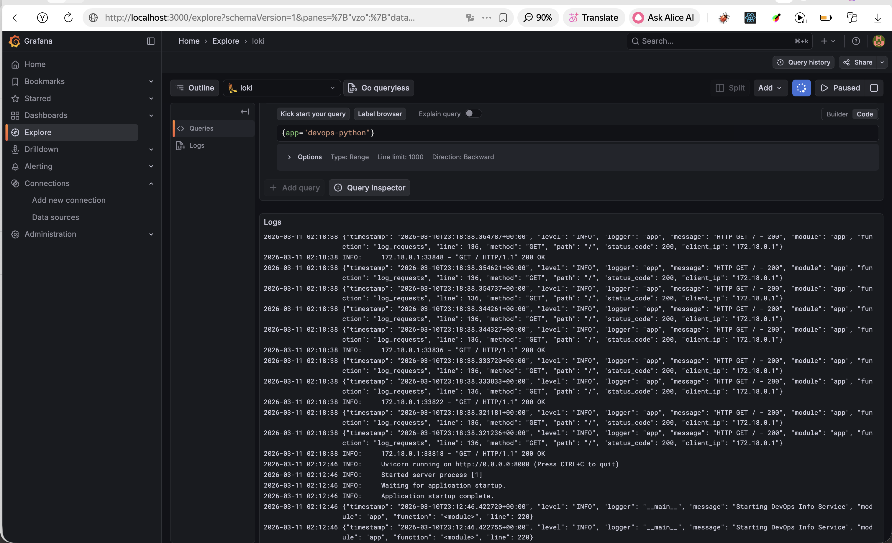
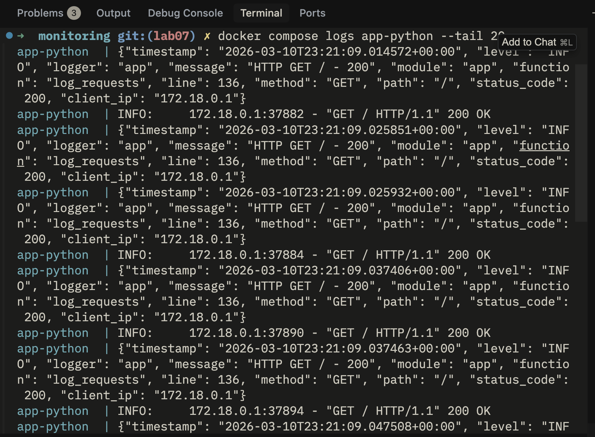
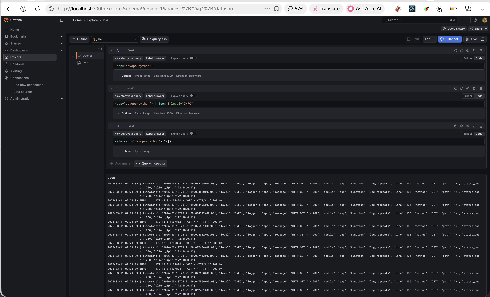
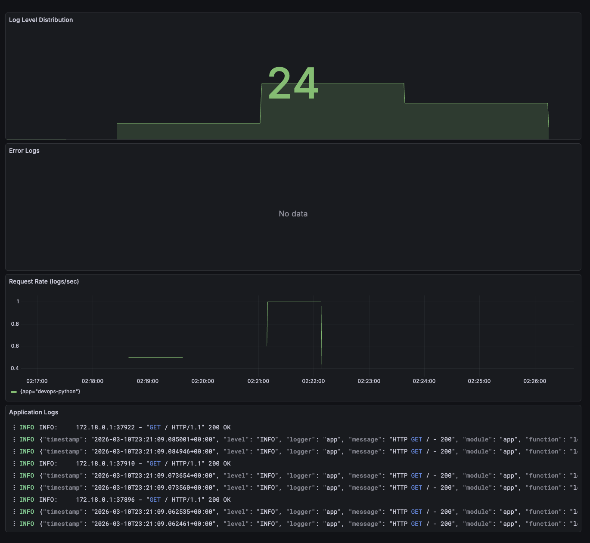
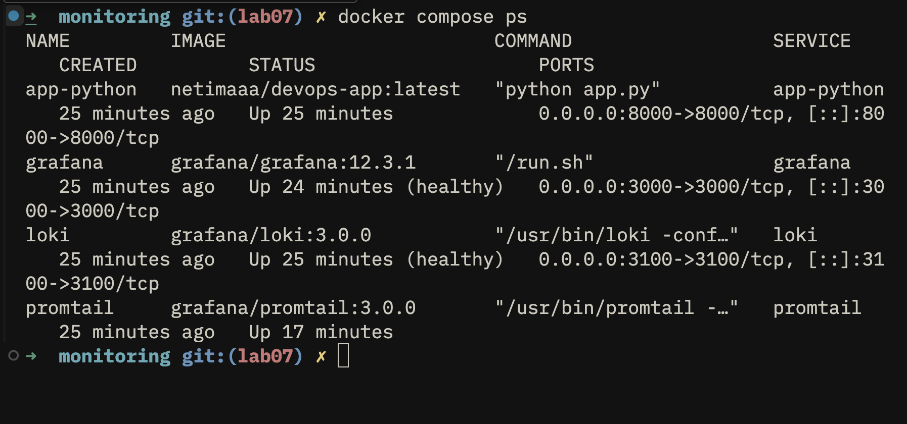
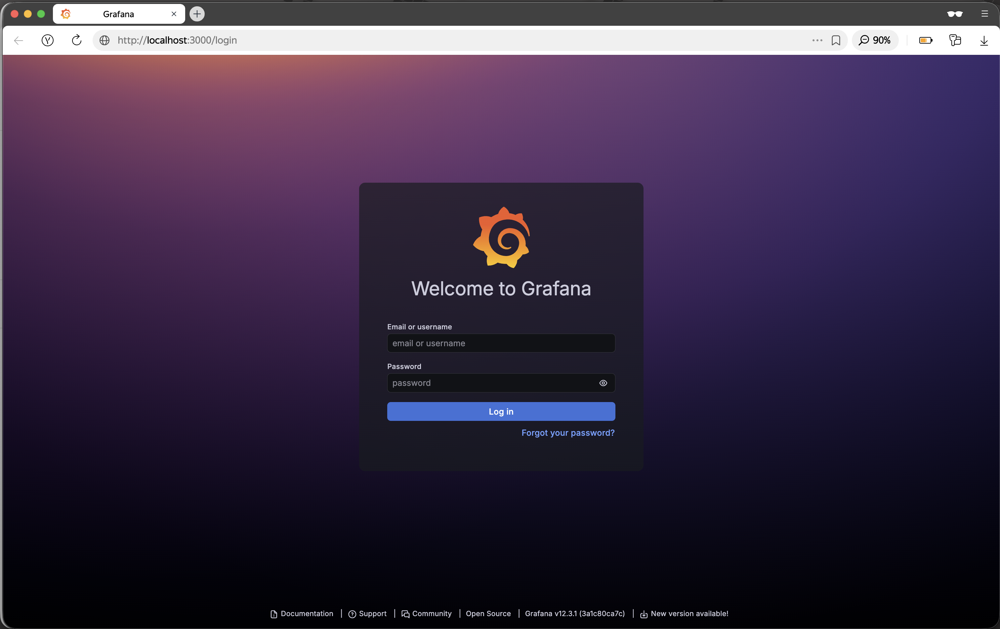

# Lab 7 — Observability & Logging with Loki Stack

## Overview

This lab implements a centralized logging solution using the Grafana Loki stack (Loki 3.0, Promtail 3.0, and Grafana 12.3.1) to aggregate and visualize logs from containerized applications.

## Architecture

```
┌─────────────────────────────────────────────────────────────┐
│                     Docker Host                              │
│                                                              │
│  ┌──────────────┐      ┌──────────────┐                    │
│  │  Python App  │      │  Other Apps  │                    │
│  │  (port 8000) │      │              │                    │
│  └──────┬───────┘      └──────┬───────┘                    │
│         │                     │                             │
│         │ JSON logs          │ logs                        │
│         │                     │                             │
│         ▼                     ▼                             │
│  ┌─────────────────────────────────────┐                   │
│  │         Promtail (port 9080)        │                   │
│  │  - Discovers Docker containers      │                   │
│  │  - Collects logs via Docker API     │                   │
│  │  - Labels & filters logs            │                   │
│  └──────────────┬──────────────────────┘                   │
│                 │                                           │
│                 │ Push logs                                 │
│                 ▼                                           │
│  ┌─────────────────────────────────────┐                   │
│  │         Loki (port 3100)            │                   │
│  │  - TSDB storage (v13 schema)        │                   │
│  │  - 7-day retention                  │                   │
│  │  - Compaction & cleanup             │                   │
│  └──────────────┬──────────────────────┘                   │
│                 │                                           │
│                 │ Query logs                                │
│                 ▼                                           │
│  ┌─────────────────────────────────────┐                   │
│  │        Grafana (port 3000)          │                   │
│  │  - Loki data source                 │                   │
│  │  - LogQL queries                    │                   │
│  │  - Dashboards & visualizations      │                   │
│  └─────────────────────────────────────┘                   │
│                                                              │
└─────────────────────────────────────────────────────────────┘
```

## Components

### Loki 3.0
- **Purpose**: Log aggregation and storage
- **Storage**: TSDB (Time Series Database) with filesystem backend
- **Schema**: v13 (optimized for Loki 3.0+)
- **Retention**: 7 days (168 hours)
- **Benefits**: 10x faster queries compared to older versions

### Promtail 3.0
- **Purpose**: Log collection agent
- **Discovery**: Docker service discovery via Docker socket
- **Filtering**: Only collects logs from containers with `logging=promtail` label
- **Labeling**: Extracts container name and app label

### Grafana 12.3.1
- **Purpose**: Log visualization and dashboards
- **Authentication**: Secured with admin password
- **Data Source**: Loki at `http://loki:3100`

## Setup Guide

### Prerequisites
- Docker and Docker Compose v2 installed
- Python app image built: `netimaaa/devops-app:latest`

### Step 1: Build Python App with JSON Logging

The Python app has been updated to output structured JSON logs:

```python
class JSONFormatter(logging.Formatter):
    """Custom JSON formatter for structured logging."""
    
    def format(self, record):
        log_data = {
            'timestamp': datetime.now(timezone.utc).isoformat(),
            'level': record.levelname,
            'logger': record.name,
            'message': record.getMessage(),
            'module': record.module,
            'function': record.funcName,
            'line': record.lineno
        }
        # Add extra fields (method, path, status_code, client_ip)
        return json.dumps(log_data)
```

Build the image:
```bash
cd app_python
docker build -t netimaaa/devops-app:latest .
docker push netimaaa/devops-app:latest  # Optional
```

### Step 2: Deploy the Stack

```bash
cd monitoring
docker compose up -d
```

### Step 3: Verify Services

Check all services are running:
```bash
docker compose ps
```

Expected output: All services should show status as "healthy".

Test individual services:
```bash
# Test Loki
curl http://localhost:3100/ready
# Expected: "ready"

# Check Promtail targets
curl http://localhost:9080/targets
# Expected: JSON with discovered containers

# Access Grafana
open http://localhost:3000
# Login: admin / admin (or password from GRAFANA_ADMIN_PASSWORD)
```

### Step 4: Configure Grafana Data Source

1. Open Grafana at http://localhost:3000
2. Login with admin credentials
3. Navigate to **Connections** → **Data sources** → **Add data source**
4. Select **Loki**
5. Configure:
   - **Name**: Loki
   - **URL**: `http://loki:3100`
6. Click **Save & Test**
7. Should show: "Data source connected and labels found"

**Evidence:**



### Step 5: Generate Test Logs

```bash
# Generate traffic to Python app
for i in {1..20}; do curl http://localhost:8000/; done
for i in {1..20}; do curl http://localhost:8000/health; done

# Generate some errors (404s)
for i in {1..5}; do curl http://localhost:8000/nonexistent; done
```

## Configuration Details

### Loki Configuration (`loki/config.yml`)

Key settings:
- **TSDB Storage**: Uses `tsdb` index type for faster queries
- **Schema v13**: Latest schema optimized for Loki 3.0+
- **Retention**: 168h (7 days) with automatic compaction
- **Filesystem**: Single-instance setup with local storage

```yaml
schema_config:
  configs:
    - from: 2024-01-01
      store: tsdb
      object_store: filesystem
      schema: v13
      index:
        prefix: index_
        period: 24h

limits_config:
  retention_period: 168h
```

### Promtail Configuration (`promtail/config.yml`)

Key features:
- **Docker SD**: Discovers containers via Docker socket
- **Label Filtering**: Only scrapes containers with `logging=promtail` label
- **Relabeling**: Extracts container name and app label

```yaml
scrape_configs:
  - job_name: docker
    docker_sd_configs:
      - host: unix:///var/run/docker.sock
        refresh_interval: 5s
        filters:
          - name: label
            values: ["logging=promtail"]
    relabel_configs:
      - source_labels: ['__meta_docker_container_name']
        regex: '/(.*)'
        target_label: 'container'
      - source_labels: ['__meta_docker_container_label_app']
        target_label: 'app'
```

## Application Logging

### JSON Log Format

The Python app outputs structured JSON logs with the following fields:

```json
{
  "timestamp": "2024-01-15T10:30:45.123456+00:00",
  "level": "INFO",
  "logger": "__main__",
  "message": "HTTP GET / - 200",
  "module": "app",
  "function": "log_requests",
  "line": 95,
  "method": "GET",
  "path": "/",
  "status_code": 200,
  "client_ip": "172.18.0.1",
  "duration_seconds": 0.0123
}
```

### Middleware Implementation

HTTP request logging is implemented via FastAPI middleware:

```python
@app.middleware("http")
async def log_requests(request: Request, call_next):
    """Middleware to log all HTTP requests."""
    start_time = datetime.now(timezone.utc)
    response = await call_next(request)
    duration = (datetime.now(timezone.utc) - start_time).total_seconds()
    
    logger.info(
        f"HTTP {request.method} {request.url.path} - {response.status_code}",
        extra={
            'method': request.method,
            'path': str(request.url.path),
            'status_code': response.status_code,
            'client_ip': request.client.host if request.client else 'unknown',
            'duration_seconds': duration
        }
    )
    return response
```

## Dashboard & LogQL Queries

### Dashboard Panels

The Grafana dashboard includes 4 panels:

#### 1. Logs Table
- **Visualization**: Logs
- **Query**: `{app=~"devops-.*"}`
- **Purpose**: Shows recent logs from all applications

#### 2. Request Rate
- **Visualization**: Time series
- **Query**: `sum by (app) (rate({app=~"devops-.*"} [1m]))`
- **Purpose**: Displays logs per second by application

#### 3. Error Logs
- **Visualization**: Logs
- **Query**: `{app=~"devops-.*"} | json | level="ERROR"`
- **Purpose**: Shows only ERROR level logs

#### 4. Log Level Distribution
- **Visualization**: Stat or Pie chart
- **Query**: `sum by (level) (count_over_time({app=~"devops-.*"} | json [5m]))`
- **Purpose**: Count logs by level (INFO, ERROR, etc.)

### LogQL Query Examples

```logql
# All logs from Python app
{app="devops-python"}

# Only errors
{app="devops-python"} |= "ERROR"

# Parse JSON and filter by method
{app="devops-python"} | json | method="GET"

# Filter by status code
{app="devops-python"} | json | status_code >= 400

# Count requests by path
sum by (path) (count_over_time({app="devops-python"} | json [5m]))

# Average request duration
avg_over_time({app="devops-python"} | json | unwrap duration_seconds [5m])

# Logs from specific time range
{app="devops-python"} | json | __timestamp__ > 1640000000
```

**Evidence:**

**JSON log output from the application:**



**Grafana with LogQL queries:**



**Dashboard with 4 panels:**



## Production Configuration

### Resource Limits

All services have resource constraints:

```yaml
deploy:
  resources:
    limits:
      cpus: '1.0'
      memory: 1G
    reservations:
      cpus: '0.5'
      memory: 512M
```

- **Loki**: 1 CPU, 1GB RAM
- **Grafana**: 1 CPU, 1GB RAM
- **Promtail**: 0.5 CPU, 512MB RAM
- **App**: 0.5 CPU, 512MB RAM

### Health Checks

Services include health checks for monitoring:

```yaml
healthcheck:
  test: ["CMD-SHELL", "wget --no-verbose --tries=1 --spider http://localhost:3100/ready || exit 1"]
  interval: 10s
  timeout: 5s
  retries: 5
  start_period: 10s
```

### Security

- **Grafana**: Anonymous authentication disabled
- **Admin Password**: Set via environment variable `GRAFANA_ADMIN_PASSWORD`
- **Docker Socket**: Mounted read-only for Promtail
- **Network Isolation**: All services on dedicated `logging` network

### Data Persistence

Named volumes ensure data survives container restarts:
- `loki-data`: Stores log chunks and indexes
- `grafana-data`: Stores dashboards and settings

## Testing

### Verify Loki is Receiving Logs

```bash
# Query Loki API directly
curl -G -s "http://localhost:3100/loki/api/v1/query" \
  --data-urlencode 'query={app="devops-python"}' | jq
```

### Check Promtail Targets

```bash
curl http://localhost:9080/targets | jq
```

### Test Log Queries in Grafana

1. Navigate to **Explore** in Grafana
2. Select **Loki** data source
3. Try these queries:
   - `{app="devops-python"}`
   - `{app="devops-python"} | json | level="INFO"`
   - `rate({app="devops-python"}[1m])`

### Verify Health Status

```bash
docker compose ps
# All services should show "healthy" status
```

**Evidence:**

**All services healthy:**



**Grafana secured (login required):**



## Challenges & Solutions

### Challenge 1: Docker Not Running
**Problem**: Docker daemon not running when trying to build image.
**Solution**: Start Docker Desktop or Docker daemon before building images.

### Challenge 2: Promtail Not Discovering Containers
**Problem**: Promtail not finding containers to scrape.
**Solution**: Ensure containers have the `logging=promtail` label and Promtail has access to Docker socket.

### Challenge 3: Loki Storage Permissions
**Problem**: Loki unable to write to storage directory.
**Solution**: Use `/tmp/loki` path which is writable in container, or configure proper volume permissions.

### Challenge 4: JSON Parsing in LogQL
**Problem**: Unable to filter by JSON fields.
**Solution**: Use `| json` parser in LogQL query before filtering: `{app="app"} | json | field="value"`

## Maintenance

### View Logs
```bash
# All services
docker compose logs -f

# Specific service
docker compose logs -f loki
docker compose logs -f promtail
```

### Restart Services
```bash
docker compose restart loki
docker compose restart promtail
docker compose restart grafana
```

### Clean Up Old Data
Loki automatically removes logs older than 7 days via the compactor.

### Backup Grafana Dashboards
```bash
# Export dashboard JSON from Grafana UI
# Or backup the grafana-data volume
docker run --rm -v monitoring_grafana-data:/data -v $(pwd):/backup \
  alpine tar czf /backup/grafana-backup.tar.gz /data
```

## Useful Commands

```bash
# Start stack
docker compose up -d

# Stop stack
docker compose down

# View status
docker compose ps

# View logs
docker compose logs -f

# Restart a service
docker compose restart loki

# Remove everything (including volumes)
docker compose down -v
```

## Next Steps

- **Lab 8**: Add Prometheus metrics to complement logs
- **Lab 9**: Deploy to Kubernetes
- **Lab 16**: Full observability stack in Kubernetes

## References

- [Loki 3.0 Documentation](https://grafana.com/docs/loki/latest/)
- [Promtail Configuration](https://grafana.com/docs/loki/latest/send-data/promtail/)
- [LogQL Query Language](https://grafana.com/docs/loki/latest/query/)
- [Grafana Dashboards](https://grafana.com/docs/grafana/latest/dashboards/)