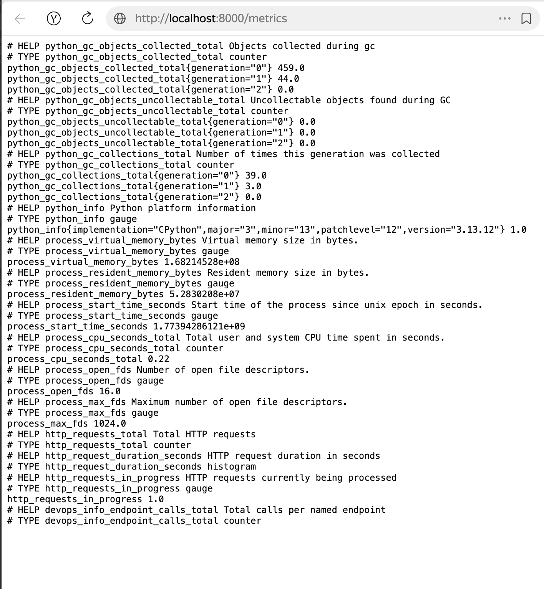
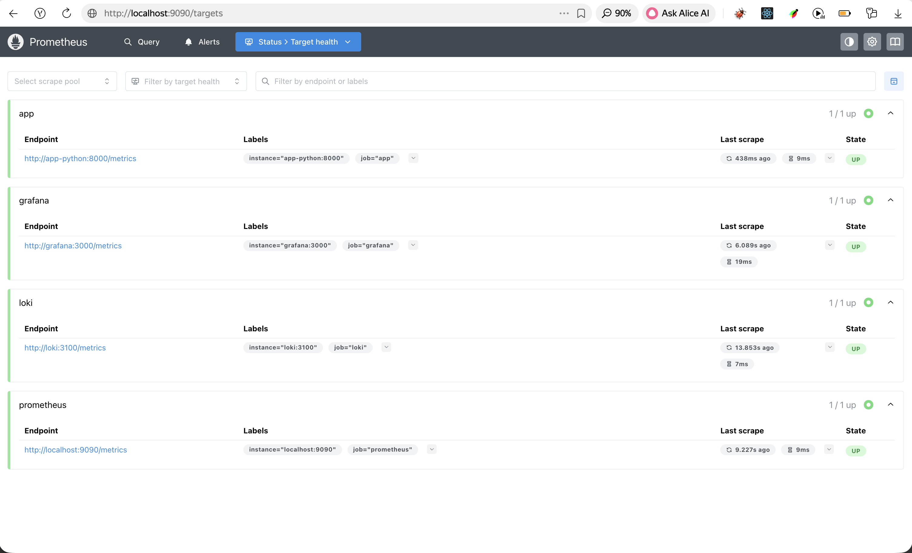
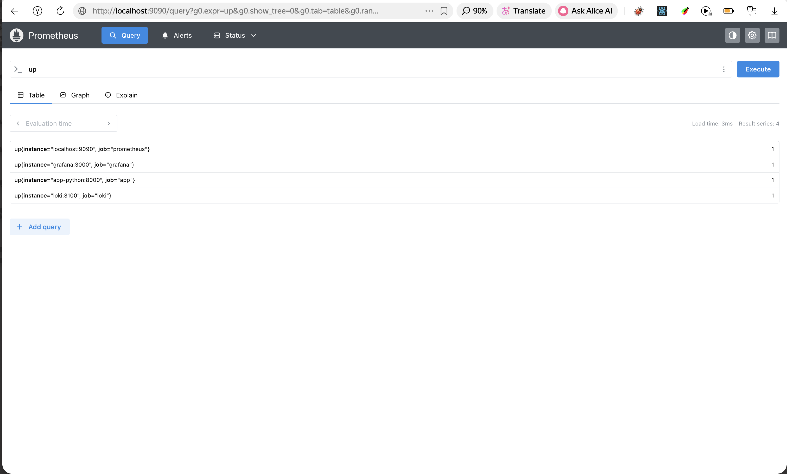
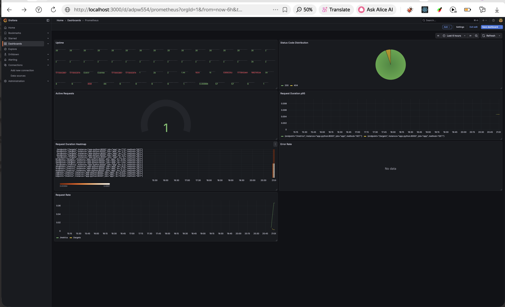
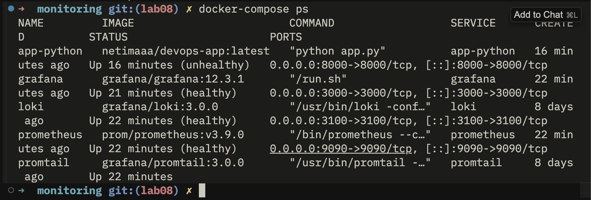
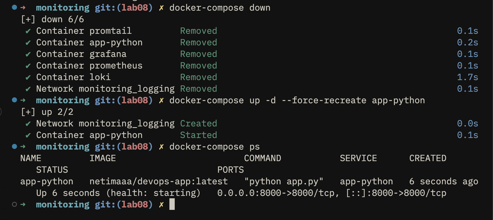

# Lab 8 — Metrics & Monitoring with Prometheus

## 1. Architecture

Metric flow:

```
Python App (FastAPI)
     │  exposes /metrics
     ▼
Prometheus (scrapes every 15s)
     │  stores time-series
     ▼
Grafana (queries via PromQL)
```

All four services (`app-python`, `loki`, `prometheus`, `grafana`) run in the same Docker Compose `logging` network, so Prometheus can reach each by its service name.

---

## 2. Application Instrumentation

### Metrics defined in `app_python/app.py`

| Metric | Type | Labels | Purpose |
|--------|------|--------|---------|
| `http_requests_total` | Counter | `method`, `endpoint`, `status` | Total number of HTTP requests (RED: Rate & Errors) |
| `http_request_duration_seconds` | Histogram | `method`, `endpoint` | Request latency distribution (RED: Duration) |
| `http_requests_in_progress` | Gauge | — | Currently active concurrent requests |
| `devops_info_endpoint_calls_total` | Counter | `endpoint` | Business-level call count per named route |

### Why these metrics

- **Counter** for request counts — only ever goes up; ideal for rate calculations with `rate()`.
- **Histogram** for durations — enables percentile queries (`histogram_quantile`).
- **Gauge** for in-progress — value can decrease; reflects real-time concurrency.
- The application-specific counter separates business logic tracking from HTTP-level tracking.

### `/metrics` endpoint output (screenshot)



---

## 3. Prometheus Configuration

**File:** `monitoring/prometheus/prometheus.yml`

```yaml
global:
  scrape_interval: 15s
  evaluation_interval: 15s

scrape_configs:
  - job_name: 'prometheus'   # self-scrape
    static_configs:
      - targets: ['localhost:9090']

  - job_name: 'app'
    static_configs:
      - targets: ['app-python:8000']
    metrics_path: '/metrics'

  - job_name: 'loki'
    static_configs:
      - targets: ['loki:3100']
    metrics_path: '/metrics'

  - job_name: 'grafana'
    static_configs:
      - targets: ['grafana:3000']
    metrics_path: '/metrics'
```

**Retention:** configured via Docker Compose command flags:
- `--storage.tsdb.retention.time=15d`
- `--storage.tsdb.retention.size=10GB`

### Targets page (screenshot)



### Successful PromQL query (screenshot)



---

## 4. Dashboard Walkthrough

Custom Grafana dashboard with 7 panels:

| # | Panel | Type | Query | Purpose |
|---|-------|------|-------|---------|
| 1 | Request Rate | Time series | `sum(rate(http_requests_total[5m])) by (endpoint)` | Requests/sec per endpoint (RED: Rate) |
| 2 | Error Rate | Time series | `sum(rate(http_requests_total{status=~"5.."}[5m]))` | 5xx errors/sec (RED: Errors) |
| 3 | Request Duration p95 | Time series | `histogram_quantile(0.95, rate(http_request_duration_seconds_bucket[5m]))` | 95th-percentile latency (RED: Duration) |
| 4 | Request Duration Heatmap | Heatmap | `rate(http_request_duration_seconds_bucket[5m])` | Latency distribution over time |
| 5 | Active Requests | Gauge | `http_requests_in_progress` | Concurrent in-flight requests |
| 6 | Status Code Distribution | Pie chart | `sum by (status) (rate(http_requests_total[5m]))` | 2xx vs 4xx vs 5xx breakdown |
| 7 | Uptime | Stat | `up{job="app"}` | 1 = service up, 0 = down |

### Dashboard screenshot



---

## 5. PromQL Examples

```promql
# 1. Request rate per endpoint (last 5 min)
sum(rate(http_requests_total[5m])) by (endpoint)

# 2. Total error rate (5xx)
sum(rate(http_requests_total{status=~"5.."}[5m]))

# 3. 95th-percentile latency
histogram_quantile(0.95, rate(http_request_duration_seconds_bucket[5m]))

# 4. Current concurrent requests
http_requests_in_progress

# 5. Services that are down
up == 0

# 6. CPU usage of the app process (%)
rate(process_cpu_seconds_total{job="app"}[5m]) * 100

# 7. Error rate as percentage of total
sum(rate(http_requests_total{status=~"5.."}[5m]))
/
sum(rate(http_requests_total[5m])) * 100
```

---

## 6. Production Setup

### Health checks

Every service has a Docker health check:

| Service | Check command | Interval | Retries |
|---------|--------------|----------|---------|
| loki | `wget ... http://localhost:3100/ready` | 10s | 5 |
| prometheus | `wget ... http://localhost:9090/-/healthy` | 10s | 5 |
| grafana | `wget ... http://localhost:3000/api/health` | 10s | 5 |
| app-python | `curl -f http://localhost:8000/health` | 10s | 5 |

### Resource limits

| Service | CPU limit | Memory limit |
|---------|-----------|-------------|
| loki | 1.0 | 1G |
| promtail | 0.5 | 512M |
| prometheus | 1.0 | 1G |
| grafana | 0.5 | 512M |
| app-python | 0.5 | 256M |

### Data retention

- **Prometheus:** 15 days / 10 GB (whichever is hit first)
- **Loki:** 168 h (7 days) — configured in `loki/config.yml`

### Persistent volumes

```yaml
volumes:
  loki-data:
  grafana-data:
  prometheus-data:
```

### `docker compose ps` (screenshot)



---

## 7. Testing Results

### Stack startup

```bash
cd monitoring
docker compose up -d
docker compose ps
```



### Data persistence after restart

1. Create a dashboard in Grafana.
2. `docker compose down`
3. `docker compose up -d`
4. Dashboard is still present — data survives because `grafana-data` and `prometheus-data` are named volumes.

---

## 8. Challenges & Solutions

| Challenge | Solution |
|-----------|----------|
| FastAPI middleware needs `try/finally` to correctly decrement the in-progress gauge even when a request raises an exception | Wrapped `call_next` in `try/finally` block |
| Prometheus `storage` block is not valid in config file for v3.x — retention is set via CLI flags | Moved retention to `command:` args in Docker Compose (`--storage.tsdb.retention.time`, `--storage.tsdb.retention.size`) |
| Grafana resource limits in Lab 7 were 1G/1CPU — lab 8 requires 512M/0.5CPU | Updated `deploy.resources` section in docker-compose.yml |

---

## Metrics vs Logs (comparison with Lab 7)

| | Logs (Lab 7 — Loki) | Metrics (Lab 8 — Prometheus) |
|--|---------------------|------------------------------|
| **What** | Individual events with context | Aggregated numeric measurements |
| **When to use** | Debugging a specific failure, audit trail | Alerting on trends, SLA/SLO tracking |
| **Storage** | Append-only log stream | Time-series TSDB |
| **Query** | LogQL (text search + aggregations) | PromQL (math on numeric series) |
| **Example** | "Request to /health failed at 14:32 from IP x.x.x.x" | "Error rate crossed 1% in the last 5 min" |

**Rule of thumb:** use metrics to know *when* something is wrong, use logs to know *why*.
